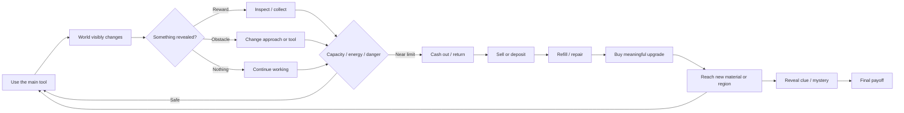

# Reusable Blueprint for Tiny Tactile Simulator Games in Unity

## Executive summary

The important thing to copy from _A Game About Digging a Hole_ is **not digging**. It is the architecture underneath the digging:

> **One satisfying physical verb → persistent visible change → uncertain discoveries → a constraint that eventually interrupts you → cash out → noticeably improve the verb → penetrate a new layer → repeat → reach one mystery/payoff.**

_A Game About Digging a Hole_ describes itself almost exactly this way: dig, collect resources, sell, upgrade equipment, keep going deeper, and uncover a secret. It remains unusually compact while still providing an economy, exploration, risk, discovery, traversal and progression. Steam currently shows roughly 90% positive English reviews from more than 11,000 reviews. citeturn13search0

The strongest lesson from studying _PowerWash Simulator_, _Crime Scene Cleaner_, _Hydroneer_, _Hardspace: Shipbreaker_, _Dome Keeper_, _Schedule I_, _My Wife Threw Out My Card Collection_, their Steam communities, developer comments, postmortems and bug reports is this:

**Complex simulation is not what makes this style work. Interaction density is.**

You want a small number of systems that affect each other constantly.

My recommended minimum structure for your first Unity game is:

| System                      | Recommendation                                      |
| --------------------------- | --------------------------------------------------- |
| Main action                 | **Exactly one** primary physical verb               |
| Materials                   | 3 initially, 5–6 in the finished game               |
| Visible world change        | Required                                            |
| Random/hidden rewards       | Required                                            |
| Scanner/detector            | Strongly recommended                                |
| Work limitation             | One: battery, heat, pressure, stamina, filter, etc. |
| Carry limitation            | One simple capacity system                          |
| Health                      | Optional; use only if mistakes need consequences    |
| Consumables                 | 0–2                                                 |
| Upgrade categories          | 4                                                   |
| World                       | One small location                                  |
| Progression regions         | 3–5                                                 |
| NPC AI                      | **None** in the first version                       |
| Physics-critical objects    | **Avoid**                                           |
| Crafting                    | **Avoid**                                           |
| Multiplayer                 | **Avoid**                                           |
| Procedural world generation | **Avoid initially**                                 |
| Story                       | One mystery, minimal dialogue                       |
| Target game length          | Roughly 2–4 concentrated hours                      |

The biggest technical recommendation is equally important:

> **Do not reproduce _Digging a Hole_'s voxel/deformable-terrain technology unless your actual fantasy requires digging. Reproduce its design with discrete, deterministic world states.**

The developer of _A Game About Digging a Hole_ was able to make the project extremely quickly partly because the idea emerged from earlier terraforming/voxel experiments for _Solarpunk_; existing technical work helped make the tiny project feasible. Therefore, its famous short development story is a dangerous benchmark for a Unity beginner starting from zero. citeturn7search0turn12search9

The review research produced five particularly important warnings:

**Never make completion depend on an invisible last 1%.** _PowerWash Simulator_ and _Crime Scene Cleaner_ players repeatedly complain about being unable to locate one tiny piece of dirt, blood or trash. citeturn14search4turn14search13turn15search5

**Never let unique progression objects depend on uncontrolled Rigidbody physics.** _My Wife Threw Out My Card Collection_ launched with items and even the player falling through the world; one community investigation found dozens of active items below the map. citeturn19search0turn19search8

**Never have two independent versions of persistent state.** _Digging a Hole_ players reported saves where upgrades remained but the excavated world reset; _My Wife_ players reported piles, upgrades and carts restoring inconsistently. citeturn13search7turn19search5

**Do not use autonomous NPCs merely to make the game look more sophisticated.** _Schedule I_ shows how worker inventories, task selection, pathfinding and automation create deadlocks and even periodic performance stutters. citeturn20search0turn20search3

**The ending must pay off the loop rather than interrupt it.** _Digging a Hole_ has players who liked the digging but disliked the abrupt final shift; _Hardspace: Shipbreaker_ has long-term players complaining that mandatory dialogue interrupts the physical activity they actually returned for; _My Wife_ has the opposite problem—players clean everything and are left in an empty yard without clear closure. citeturn13search3turn16search2turn19search1

That leads to the blueprint I would actually use for your AI-assisted Unity project:

> **TACTILE VERB + MATERIAL HIERARCHY + UNCERTAIN DISCOVERY + VISIBLE DESTRUCTION/CLEANUP + CAPACITY/ENERGY PRESSURE + SAFE CASH-OUT + FOUR MEANINGFUL UPGRADES + NEW MATERIAL LAYERS + ONE CLEAR ENDGOAL.**

## What the reference games actually teach

These games are useful because each isolates a different part of the formula. The ratings below for complexity, bug risk and solo effort are **my engineering assessment**, not developer-reported numbers. “Solo effort” means how difficult I think reproducing the relevant mechanics would be for a first-time solo Unity developer using AI and marketplace assets.

| Game                                     | The useful lesson                                                                                        |  Complexity |                                                  Bug risk |   Solo difficulty if copied literally |
| ---------------------------------------- | -------------------------------------------------------------------------------------------------------- | ----------: | --------------------------------------------------------: | ------------------------------------: |
| **A Game About Digging a Hole**          | Compact expedition/economy/discovery loop; physical progress itself creates traversal                    |      Medium |                             High because terrain persists | **4/5** with true terrain deformation |
| **PowerWash Simulator**                  | One verb can carry a game if feedback and before/after transformation are excellent                      |      Medium |       Medium–High because every surface stores completion |                               **3/5** |
| **Crime Scene Cleaner**                  | Cleaning becomes more interesting when combined with searching, valuables and environmental storytelling | Medium–High |                                High due many props/states |                               **4/5** |
| **Hydroneer**                            | Physicality can create charm, but excessive object physics becomes friction and performance debt         |        High |                                                 Very High |                               **5/5** |
| **Hardspace: Shipbreaker**               | Materials + tools + hazards create depth without traditional combat                                      |   Very High | Extreme because physics/destruction are gameplay-critical |                              **5/5+** |
| **Dome Keeper**                          | Two simple activities can create tension by competing for the same resource: time                        |      Medium |                                                    Medium |                               **3/5** |
| **My Wife Threw Out My Card Collection** | Strong unknown-reward premise; excellent case study in persistence/physics/completion failures           |      Medium |                                                      High |                             **3.5/5** |
| **Schedule I**                           | Strong home→production→sell→expand progression, but shows the cost of NPC automation                     |   Very High |                                                   Extreme |                               **5/5** |

_A Game About Digging a Hole_ combines digging, physical resource discovery, selling, equipment upgrades, carrying capacity, battery management, a jetpack for vertical mobility, dynamite for resistant material and lamps for darkness. A player summary captures how little machinery is actually required: shovel/drill, larger dig radius, ore capacity, battery, jetpack and several consumables. citeturn13search6

But its **geometry is doing enormous amounts of design work**. Every scoop simultaneously does several things:

**removes an obstacle → exposes potential treasure → consumes battery → increases depth → changes the route → potentially makes returning harder.**

That is a remarkable amount of gameplay from one input.

Community discussion exposes the consequence. Players talk about digging ramps instead of going straight down, using lights as route markers and reserving battery for getting back out. Movement/fall complaints also show that the shape of the player's excavation becomes an actual hazard. citeturn12search1turn13search10

This is the most important concept to generalize:

> **The primary action should ideally have more than one consequence.**

It does **not** mean every game needs a difficult physical return journey.

A pressure washer might:

**clean surface + consume water + expose markings + push completion toward a reward.**

A cutter might:

**damage scrap + consume battery + expose a component + increase heat.**

A vacuum might:

**remove clutter + fill its container + expose valuables + clear access to another region.**

That is the generic system.

### The tactile lesson from PowerWash Simulator

_PowerWash Simulator_ has an extraordinarily simple fantasy—the official Steam page literally centers the experience around spraying grime until things are clean, and its English reviews remain about 97% positive across more than 38,000 reviews. citeturn14search0

FuturLab's designers have described an important design principle: the prototype first had to prove that cleaning itself was satisfying before the larger job structure was built around it. The designers deliberately prioritize the _feeling_ and readability of cleaning over literal realism. citeturn11search1

Its success is not “there is dirt and you remove it.” It is the feedback stack:

**dirty surface → spray impact → visible clean trail → changing texture → sound → section completion → confirmation/reward.**

It also offers differently shaped nozzles, trading coverage for concentrated cleaning power, and highlights remaining dirt. Those are variations of **the same verb**, rather than unrelated minigames. citeturn11search2

This suggests a powerful rule for your games:

> **Add depth vertically through responses to the verb before adding more verbs.**

One cutter interacting differently with **plastic / sheet metal / hardened steel / electrical components** is cheaper and safer than implementing four unrelated tools with unrelated code.

### The search-and-clean lesson from Crime Scene Cleaner

_Crime Scene Cleaner_ layers searching and environmental discovery onto cleaning. The official design includes different cleaning tools, valuables/evidence hidden within scenes, equipment improvements and environmental storytelling. Its English Steam reviews are about 98% positive across more than 15,000 reviews. citeturn15search1

The valuable part for us is:

> **Repetitive transformation becomes stronger when there is uncertainty inside the thing being transformed.**

Cleaning is predictable.

Finding an expensive watch while cleaning is not.

Removing garbage is predictable.

Discovering a hidden compartment is not.

This is exactly what ore accomplishes in _Digging a Hole_.

However, both _Crime Scene Cleaner_ and _PowerWash_ expose the **completion detection problem**. One positive _Crime Scene Cleaner_ review jokes that the game is so enjoyable that searching for the final bullet casing or blood spot does not ruin it; earlier demo feedback contains cases where trash or a shell casing became embedded in geometry and made completion impossible. citeturn15search5turn15search6

That means your detector is more than a fun mechanic.

**It is also a QA safety system.**

### The “do not over-physicalize everything” lesson from Hydroneer and Shipbreaker

_Hydroneer_ is valuable precisely because it shows the other extreme. Physical ores, machines, conveyors and manually handled objects create a distinctive simulation, but negative reviews complain about clumsy handling, absence of a normal inventory and upgrades eventually becoming more of the same. One current negative review describes progression as **“improve for the sake of improving.”** citeturn16search1turn16search4

Performance discussions also describe large quantities of resources degrading performance, resources overlapping or behaving differently at different frame rates. citeturn16search3turn16search13

_Hardspace: Shipbreaker_ demonstrates what can be achieved when physics is genuinely central: ships can be cut apart, pieces moved with a grapple, and hazards include decompression, fuel, electricity and radiation. citeturn16search0

It is an excellent design reference.

It is a **terrible scope reference** for your first project.

The principle to borrow is:

> **Materials should create different decisions.**

Do not borrow:

> **Every object must be a fully simulated physical object.**

### The pressure lesson from Dome Keeper

_Dome Keeper_ explicitly forces the player to decide whether to continue mining or return before the next attack. Resources brought home improve drilling, movement and defense. citeturn17search12

Its designers have discussed building systems that feed into one another and using game jams/smaller projects to learn how to actually finish games after earlier projects became too large. citeturn11search0

The reusable concept is not “waves of aliens.”

It is:

> **A second pressure prevents the optimal strategy from being “keep doing the main action forever.”**

Your pressure might be:

battery  
inventory fullness  
tool temperature  
oxygen  
filter capacity  
incoming weather  
machine durability  
contract deadline.

Use **one**, not six.

### The Schedule I lesson

_Schedule I_ is enormously successful in review volume—Steam currently shows roughly 97% positive English reviews from around 200,000 reviews—and its high-level progression from small operation to increasingly capable properties, production and distribution is worth studying. It is still an Early Access game. citeturn20search5turn20search8

But its bug reports reveal exactly why you should not copy its implementation complexity.

Players have reported chemists and botanists becoming stuck between workstation, inventory and task states; some found the only reliable workaround was rehiring workers or manipulating their saved inventory state. citeturn20search0turn20search2

Other users isolated periodic stuttering to botanists or their task/pathing logic, particularly when workers were idle or had problematic paths. citeturn20search3turn20search9

So borrow:

**start weak → earn → buy capability → operation becomes dramatically more powerful.**

Do not initially borrow:

**NPC schedules + autonomous inventories + work queues + navmesh pathfinding + workstation reservations + multiplayer synchronization.**

That distinction is enormous.

## Reusable simulator blueprint

The blueprint should be understood as **roles**, not specific mechanics. “Ore” is not a requirement. “Battery” is not a requirement. “Going downward” is not a requirement.

The requirement is that each role has an implementation appropriate to the fantasy.

### The core loop



You should also maintain a Mermaid **persistent-object state diagram** during development:

`Hidden → Exposed → Available → Collected → Sold/Archived`

and a release timeline diagram:

`Feature → Tests → Packaged build → Closed test → Release candidate → Public`.

Those two diagrams will probably prevent more AI-development bugs than a giant conventional design document.

### The moment-to-moment rhythm

A good tiny simulator operates at several timescales simultaneously.

| Timescale         | What should happen                                                  |
| ----------------- | ------------------------------------------------------------------- |
| **0–1 second**    | Input produces sound, movement, particle/decal and visible response |
| **2–10 seconds**  | Material/object noticeably changes                                  |
| **10–45 seconds** | Small reward, obstruction or discovery                              |
| **1–5 minutes**   | Capacity/resource decision: continue or cash out                    |
| **10–20 minutes** | Meaningful upgrade or new material                                  |
| **20–40 minutes** | New region/visual state/problem                                     |
| **Whole game**    | One mystery moves steadily closer to resolution                     |

These are design targets rather than industry rules. They are consistent with the user-provided game-design transcript's argument that short incremental games work when progression continues rather than turning into exponentially longer waits. fileciteturn0file0

### Material and terrain interaction

This is the most important low-level system.

Do **not** begin with:

`Raycast → Destroy(GameObject)`

Instead make interaction a formal pipeline:

`INPUT → TARGET → MATERIAL → RESISTANCE → PROGRESS → STATE CHANGE → FEEDBACK → POSSIBLE REWARD`

A material definition should contain something like:

```text
Material ID
Resistance
Required tool tier
Tool effectiveness multiplier
Impact sound
Impact particle
Hit decal
Break/clean threshold
Reward table
Hazard type
Replacement state/model
```

An object then has a persistent interaction state:

```text
Object ID: junk_car_0042
Material: ThinMetal
Progress: 0.62
State: Damaged
LootRevealed: false
Collected: false
```

For a low-bug Unity implementation, prefer:

**Intact model → damaged model → destroyed/clean model**

or

**surface mask 100% → 0%**

or

**grid/cell states**

over arbitrary runtime mesh cutting.

That gives the _appearance_ of physical simulation while the underlying data remains discrete.

A piece of junk can break spectacularly into cosmetic fragments at zero health, but **the gameplay state should already have transitioned deterministically**. The fragments should not determine whether the game considers the object destroyed.

This is the difference between:

**physics as feedback**

and

**physics as database**.

Use the first.

### Material hierarchy

A finished tiny simulator generally needs only about five material roles:

| Role          | Player experience                | Example                              |
| ------------- | -------------------------------- | ------------------------------------ |
| **Basic**     | Main verb works immediately      | dirt, grime, weak junk               |
| **Valuable**  | Normal action exposes reward     | copper, collectible, component       |
| **Resistant** | Slow now; easy after upgrade     | concrete, thick deposit, hardwood    |
| **Blocked**   | Requires special tool/consumable | reinforced plate, sealed hatch       |
| **Hazardous** | Punishes careless action         | live wire, hot pipe, unstable object |
| **Secret**    | Hides mystery/progression        | false wall, locked compartment       |

You do not need fifty resources.

You need **a few things that respond differently enough to make the player notice their equipment improving**.

_A Game About Digging a Hole_ uses ordinary excavation, increasingly valuable finds, resistant rock handled with dynamite and progressively darker underground environments where lamps become useful. citeturn13search6

### World transformation

This is mandatory.

The game should look different after an hour because the player has worked on it.

Examples:

`dirty → clean`

`full → empty`

`intact → dismantled`

`blocked → open`

`flooded → drained`

`cluttered → cleared`

`overgrown → stripped`

That produces a second progress meter that costs almost no UI:

> **the world itself.**

This is part of why the growing excavation in _Digging a Hole_ is satisfying even before considering money or upgrades. Press coverage also noted how the excavation itself becomes a visible record of progress. citeturn7news27

### Resource discovery

Do not award currency continuously for every hit.

Separate:

**work**

from

**reward reveal**.

For example:

```text
Smash
Smash
Smash
Crack opens

nothing

Smash

COPPER MOTOR
```

That moment is much stronger than:

`+$0.13`
`+$0.13`
`+$0.13`

Use a deterministic random seed when a save is created:

```text
Save Seed
→ Region
→ Loot Nodes
→ Rarity
→ Hidden Location
```

Then save the generated results.

Do **not** roll the important reward every time the object is opened. Otherwise save/reload can reroll loot and AI-written code can accidentally duplicate items.

Recommended rarity philosophy:

| Reward             | Function                        |
| ------------------ | ------------------------------- |
| Common             | Keeps economy moving            |
| Uncommon           | Small excitement                |
| Rare               | Noticeably advances progression |
| Very rare          | Screenshot/clip moment          |
| Handcrafted secret | Advances mystery                |

Randomness should create anticipation, but the game should **guarantee that progression-critical objects exist**.

### Inventory

The inventory exists to interrupt greed.

Without capacity, the rational strategy is usually:

> keep working forever.

Capacity creates:

> “I have room for one more valuable thing.”

For your first game, use either **slots** or a single **weight number**.

Do not build a grid inventory.

Critical rule:

> **When full, refuse the pickup. Never destroy the reward.**

Display:

`Inventory 7 / 8`

and leave the object in the world.

Unique quest/ending objects should bypass ordinary capacity or use their own guaranteed slot.

Persistent inventory data should contain stable IDs—not references to scene GameObjects.

### Detector and scanner

I strongly recommend including this in the reusable blueprint.

It serves three jobs simultaneously:

**Discovery mechanic:** “Something is nearby.”

**Pacing tool:** It interrupts repetitive work.

**QA recovery tool:** It prevents the final hidden object from becoming impossible to locate.

The ideal scanner is extremely simple:

```text
Player presses Scan
        ↓
Find nearest eligible hidden/revealed target
        ↓
Calculate distance
        ↓
Return signal strength
        ↓
Audio/visual pulse
```

Do not scan every physics collider every frame.

Maintain a registry of valid discoverables and query it perhaps when the player presses the scanner or several times per second.

Useful states:

```text
No signal
Weak
Medium
Strong
Very strong
Target exposed
Area exhausted
```

The **“area exhausted”** response is important. It prevents the player spending 30 minutes searching an area that contains nothing.

Near the final part of the game, the scanner can become more explicit.

For example:

Early:

`beep`

Late upgrade:

`Rare object: 8.4m`

That naturally reduces frustration as completion becomes more important.

PowerWash's long-running “last bit of dirt” discussions are an excellent warning here. Players can become furious when they know a section is incomplete but the highlighting system does not clearly identify what remains. citeturn14search4turn14search8

### Energy and other constraints

_A Game About Digging a Hole_ uses battery as a powerful constraint because it limits continued tool use, while traversal equipment also matters as the player gets farther underground. citeturn13search6turn12search0

Generic equivalents include:

| Theme            | Work constraint           |
| ---------------- | ------------------------- |
| Electric cutter  | Battery                   |
| Pump             | Heat                      |
| Vacuum           | Filter/container fullness |
| Pressure washer  | Water/pressure            |
| Diving           | Oxygen                    |
| Furnace          | Temperature               |
| Industrial drill | Coolant                   |
| Chemical cleaner | Chemical supply           |
| Heavy machinery  | Fuel                      |

The rule is:

> **The resource should create decisions, not merely chores.**

One main resource is enough.

Two can work if they serve clearly different purposes.

Five survival meters will turn your tiny simulator into a survival game.

### Hazards and failure

Prefer environmental/systemic hazards over enemies for version one:

fall damage  
tool overheat  
live electricity  
hazard material  
pressure  
machine failure.

Failure should usually cost:

**current haul**

or

**a small repair fee**

while preserving:

**world transformation + purchased upgrades + discovered permanent progression.**

This creates tension without making a two-hour game infuriating.

Be extremely careful around boundary values:

```text
Energy = 0
Health = 0
Inventory = Max
ToolProgress = exactly 1
Money = exactly upgrade price
```

Each should transition once.

Not:

```text
Update()
if battery <= 0:
    explode()
```

running every frame until another state changes.

Use:

```text
Working → Depleted → Failed → Respawned
```

as an explicit state machine.

### Consumables

For the first game, cap these at two.

**Navigation/discovery consumable:** lamp, marker, beacon.

**Obstacle-bypass consumable:** explosive, cutting disc, chemical charge.

Consumables are useful because they create optional decisions without adding new permanent systems.

Avoid crafting them.

Just buy them.

### Hub

The hub should collapse multiple chores into one safe place:

**sell → refill → repair → upgrade → save.**

That is enough.

Do not build:

blacksmith  
merchant  
bank  
garage  
upgrade specialist  
quest giver.

One workstation, van, table or computer can provide everything.

The hub creates an emotional rhythm:

**tension → safety → reward → empowerment → leave again.**

The return does **not** need to be mechanically difficult in every game. The key requirement is simply that the game periodically interrupts continuous work and converts temporary progress into permanent capability.

### Upgrades

I would standardize almost every prototype around four families:

| Upgrade                         | Purpose                                       |
| ------------------------------- | --------------------------------------------- |
| **Power / coverage**            | Main verb becomes dramatically more effective |
| **Endurance**                   | Longer expedition/work period                 |
| **Capacity**                    | More rewards before cash-out                  |
| **Access / mobility / scanner** | New areas or information become available     |

Use perhaps 3–5 tiers each.

The critical rule:

> **An upgrade should alter the player's experience, not merely a hidden spreadsheet.**

Weak:

`Damage 8 → 8.4`

Better:

`One panel takes 8 seconds → 5 seconds`

Excellent:

`Tool now tears through the material that previously stopped you.`

That is why a material hierarchy and upgrades should be designed **together**.

Hydroneer's criticism is useful here: some players feel later machines merely reproduce the same production at a larger number, causing progression to become “improve for the sake of improving.” citeturn16search1

### Progression layers

Do not generate a giant world.

Make **one small world with layers of permission**.

A good progression structure looks like:

| Region | New reward | New material   | New complication  |
| ------ | ---------- | -------------- | ----------------- |
| Intro  | Common     | Basic          | Learn verb        |
| Early  | Uncommon   | Resistant      | Capacity          |
| Mid    | Rare       | Hard barrier   | Scanner           |
| Late   | Very rare  | Hazard         | Resource pressure |
| Final  | Secret     | Unique blocker | Mystery payoff    |

The environment can be physically tiny.

What matters is:

> “That thing I couldn't deal with 30 minutes ago is now trivial.”

This gives you Metroidvania-like satisfaction without building a Metroidvania.

### Mystery and endgame

A tiny repetitive simulator benefits enormously from **one unanswered question**.

Not extensive lore.

Not 25 quests.

Just:

> “What is behind that?”

> “Why is this here?”

> “What is inside the final container?”

> “What caused the blockage?”

> “What will be exposed when everything is gone?”

Show the question early.

Answer it late.

Most importantly:

**The finale should still use the mechanic the player loves.**

One _Digging a Hole_ review summarizes the problem well: the reviewer enjoyed digging but disliked the final enemy/run-away sequence. Another calls the ending abrupt despite enjoying the main gameplay loop. citeturn13search3turn13search6

_Hardspace_ provides another version of this lesson. Some veteran players praise the actual shipbreaking while complaining that they cannot skip repeated story dialogue:

> “I’m here to play the game, not stare at a terminal.” citeturn16search2

Therefore:

> **Do not reward someone for loving your one verb by taking that verb away in the finale.**

## Failure modes and what reviews tell us

The strongest community pattern across these games is not “players hate repetitive gameplay.”

Many players actively **want** repetition.

They hate **friction that is not part of the fantasy**.

### The difference between good friction and bad friction

**Good friction:**

battery forces return  
hard material encourages upgrade  
limited capacity causes greed  
tool overheating creates timing  
scanner signal makes you investigate  
riskier location contains better reward.

**Bad friction:**

one collectible fell through floor  
99.9% completion but nothing highlights  
cart refuses to hold object  
NPC gets stuck  
UI vanishes  
save restores half the systems  
five minutes of mandatory dialogue  
walking repeatedly because inventory design is deliberately inconvenient.

That distinction appears repeatedly across the reference games. citeturn14search4turn15search6turn16search4turn19search1

### My Wife Threw Out My Card Collection as a case study

This is probably the most useful warning for your project.

Its premise is extremely close to the blueprint we want: Steam describes it as digging/sorting through piles of junk with a chance to discover rare cards, restoring a collection and rescuing birds. citeturn18search0

Conceptually:

**trash → uncertainty → rare collectible → visible cleanup → progression**

is excellent.

But as of September 2026 its Steam rating is only around **65% positive from about 1,600 reviews**, which is dramatically weaker than _Digging a Hole_, _PowerWash Simulator_ or _Crime Scene Cleaner_. citeturn18search0

The developer's own launch post is remarkably candid. One day after release, the developer said players had lost saves, seen the warehouse disappear and fallen through the map, acknowledging that the launch had been rushed and “way too many bugs” had escaped. The hotfix addressed saves, warehouse disappearance, items/player falling through the map and teleport problems. citeturn19search0

That is almost a checklist of exactly what **not** to permit in your architecture.

Current negative reviews still report problems with upgrades/cash resetting, repeated duplicate cards, unclear collection completion, janky movement/object handling and no satisfying final confirmation. One player reaches an empty property and describes the result as:

> **“Just emptyness. Unsatisfying silence.”** citeturn19search1

Community threads show additional systemic failures:

| Failure                                          | Why it is particularly dangerous                               |
| ------------------------------------------------ | -------------------------------------------------------------- |
| Upgrade state resets while world remains cleared | Permanent-state systems disagree                               |
| Trash pile duplicates after load                 | Scene initialization and save restoration both spawned content |
| Valuable falls through map                       | Physics can permanently remove progression                     |
| Cart upgraded logically but displays old form    | Visual state and gameplay state disagree                       |
| Missing bird/card                                | Completion becomes impossible                                  |
| Dog gets trapped inside trash                    | AI/pathfinding becomes progression dependency                  |
| UI disappears after an upgrade                   | State transition affects unrelated system                      |
| Autosave gets overwritten                        | Recovery mechanism makes failure worse                         |
| No explicit ending                               | Player cannot tell whether game is complete                    |

These reports appear across developer threads and user discussions. citeturn19search4turn19search5turn19search6turn19search8turn19search9

One community investigation is particularly valuable: a player inspecting their save reported **58 active items at approximately `y = -33` below the map** and suggested moving out-of-bounds objects back into playable coordinates. citeturn19search8

That should become an automated feature in your game.

**How I would improve My Wife's structure:**

| Existing weakness                   | Blueprint improvement                                     |
| ----------------------------------- | --------------------------------------------------------- |
| Cards can be missing/duplicated     | Generate deterministic card pool at new game              |
| Duplicate cards become frustrating  | Duplicate protection or duplicate→currency conversion     |
| Collection total unclear            | `Cards 31 / 40` plus missing-region hints                 |
| Last objects may disappear          | Persistent IDs + world-bounds recovery                    |
| Cart relies on throwing physics     | Snap volumes / automatic storage                          |
| Dog can get stuck                   | Remove autonomous helper AI                               |
| Cleaning cards adds little decision | Make reveal tactile/brief or remove it                    |
| Upgrades reset independently        | One authoritative GameState                               |
| Weak ending                         | Explicit final card/reveal/credits                        |
| Repetition stops changing           | Every region introduces material/reward/upgrade threshold |

The core premise is good.

The execution simply allows too many stateful systems to fail independently.

### The “last one” failure

This issue appears in several games.

A _PowerWash Simulator_ demo player was missing two wooden trims, could not find visible dirt with the game's highlight feature and explicitly said the frustration was enough to discourage purchase. Other long-running threads discuss tiny remaining specks preventing completion. citeturn14search4turn14search13

_Crime Scene Cleaner_ has reports of shell casings/trash becoming embedded in floors or geometry, leaving the player unable to finish the cleanup. citeturn15search6

Your game therefore needs a **completion escape hatch**.

At perhaps 90–95% completion:

**scanner becomes more accurate.**

At 98%:

**remaining category/count becomes visible.**

At 99%:

**direct highlight or compass indicator becomes available.**

That is not “making the game too easy.”

It is protecting the player from your collision and content-placement bugs.

### Persistence failure

_Digging a Hole_ players reported cases where upgrades remained but the ground returned to its original state after reopening the game. citeturn13search7

_Dome Keeper_ has had multiple community reports involving lost progress, save/cloud interactions and update/migration problems; its developers have responded directly to some cases and added/recommended recovery methods. citeturn17search3turn17search5

The reusable lesson is:

> **Save/load is not an auxiliary feature. In a game about permanently transforming a world, save/load is part of the core mechanic.**

Treat it that way from week one.

### Physics failure

Physics makes tiny simulators look alive, but progression-critical physics is disproportionately dangerous.

_Hydroneer_ players have documented overlapping resources, performance degradation and physics behavior that appears sensitive to frame conditions. citeturn16search3turn16search13

_Crime Scene Cleaner_ reports include items getting stuck in geometry, cumbersome carried objects and furniture disappearing into walls in special modes. citeturn15search6turn15search11

_My Wife_ had launch bugs involving objects literally leaving the playable world. citeturn19search0turn19search8

Therefore use this rule:

> **Anything required for completion should never rely exclusively on Rigidbody simulation for its existence or location.**

Coins can bounce.

Debris can fly.

Garbage can tumble.

But the unique key should be represented in authoritative game state.

### Performance failure

These games also expose a useful pattern: performance often gets worse **late**, after systems accumulate.

_Dome Keeper_ users have reported severe slowdown when many resources are loose and some update-related stutters; developers requested logs and investigated resource-loading issues. citeturn17search6

_Hydroneer_ has similar reports as physical resources and production increase. citeturn16search3

_Schedule I_ provides an especially instructive case where autonomous worker/task logic has been associated by users with repeated stutters. citeturn20search3turn20search9

Your performance test should therefore be:

> **the worst possible late-game save**, not the first ten minutes.

## Unity architecture and AI-friendly prototype order

For you, **architecture is a bug-prevention strategy**.

The AI should be given a small number of explicit systems with clear ownership.

### One authoritative state

Do not allow:

```text
Scene says object exists
SaveManager says collected
Inventory says player carries it
QuestManager says not found
Spawner says spawn again
```

Use one authoritative structure conceptually like:

```text
GameState
 ├── PlayerState
 ├── EconomyState
 ├── UpgradeState
 ├── WorldState
 │    └── PersistentObjectState[ID]
 ├── InventoryState
 └── ProgressionState
```

Scene objects are **representations of GameState**.

They are not a competing source of truth.

Every persistent object needs a stable ID:

```text
zone02_safe_01
zone02_motor_07
zone03_secret_panel
```

Never identify persistent objects by current position.

Positions change.

IDs do not.

### Data-driven definitions

Use ScriptableObjects for **definitions**, not mutable save state:

```text
MaterialDefinition
ToolDefinition
LootDefinition
UpgradeDefinition
RegionDefinition
```

Example:

```text
CopperMotor
Value = 80
Weight = 2
Rarity = Uncommon
ScannerStrength = 1
```

Do not have AI duplicate those constants across six scripts.

Runtime state stays in plain serializable state objects.

### Make physics cosmetic whenever possible

Preferred:

```text
Machine health reaches 0
→ GameState marks machine destroyed
→ rewards become available
→ broken replacement model appears
→ cosmetic debris receives Rigidbody forces
→ debris despawns later
```

Avoid:

```text
Machine physically fractures
→ hope all fragments behave
→ wait for physics to determine what's accessible
→ infer game progression from where fragments landed
```

The first looks nearly as impressive and is radically easier to test.

### Make scanning deterministic

The scanner should ask something like:

```text
DiscoveryRegistry.GetNearestEligibleTarget(playerPosition)
```

not:

```text
Physics.OverlapSphere(...)
→ inspect random components
→ hope hidden collectible collider is active
```

This makes the scanner testable without rendering or physics.

### Keep systems event-driven

Prefer:

```text
OnObjectDestroyed
OnLootCollected
OnInventoryChanged
OnUpgradePurchased
OnZoneUnlocked
```

over having every manager check everything every frame.

The worker problems reported in _Schedule I_ are a useful warning about frequent autonomous task evaluation interacting with complex state. citeturn20search0turn20search3

### Prototype priority for minimum bugs

Build in this order:

| Priority | Feature                         | Why now                          |
| -------: | ------------------------------- | -------------------------------- |
|   **P0** | First-person controller         | Basic usability                  |
|   **P0** | One interaction ray/spherecast  | Everything depends on it         |
|   **P0** | One tool                        | Prove verb is satisfying         |
|   **P0** | Three material types            | Prove variety without more verbs |
|   **P0** | Persistent object IDs/state     | Prevent architectural rewrite    |
|   **P0** | Save/load                       | Test persistence immediately     |
|   **P1** | Loot reveal/pickup              | Creates discovery loop           |
|   **P1** | Simple inventory capacity       | Creates cash-out pressure        |
|   **P1** | Sell station                    | Completes economy                |
|   **P1** | Four upgrade statistics         | Completes progression            |
|   **P1** | Scanner                         | Discovery + anti-frustration     |
|   **P1** | One work resource               | Push-your-luck pressure          |
|   **P2** | Three small progression regions | Demonstrates complete game arc   |
|   **P2** | One resistant material          | Upgrade gating                   |
|   **P2** | One hazard                      | Consequence                      |
|   **P2** | One consumable                  | Problem-solving                  |
|   **P2** | Final secret/end screen         | Tests complete game state        |
|   **P3** | Juice/polish                    | Particles, audio, camera motion  |
|   **P3** | More props/content              | Only after the loop works        |

Your **first playable prototype** should therefore contain:

> **one room/yard + one tool + three materials + six loot objects + one inventory + one sell station + four upgrades + one scanner + one save file + one ending.**

It should take **20–30 minutes** to complete.

Do not add a second map until somebody besides you finishes that build and immediately wants another run.

### Explicit “do not implement yet” list

For your first AI-built game:

**No NPC workers.**

**No companion AI.**

**No multiplayer.**

**No vehicles.**

**No dynamic building destruction.**

**No realistic fluids.**

**No arbitrary voxel terrain unless digging is literally the premise.**

**No free-form crafting.**

**No procedural world generation.**

**No dynamic economy.**

**No day/night schedules.**

**No physical grid inventory.**

**No quest dependency graph.**

**No hundreds of persistent Rigidbodies.**

**No dialogue system.**

Every one of these can make a game better.

None is required to prove the tiny-simulator loop.

## QA, telemetry and staged release

This is where AI-assisted development needs to differ from casual solo development.

Unity's Test Framework supports tests in both **Edit Mode and Play Mode**, including running against target platforms. Unity's engineering tooling also includes profiling/analysis tools intended for comparing frame behavior. citeturn21search0turn21search4

### Automated test suite

Your AI coding instruction should be:

> **Every feature requires tests for its normal state, boundary state and save/load state. Do not mark the feature complete until those tests pass.**

Recommended suite:

| Test class            | Automated cases                                                                            |
| --------------------- | ------------------------------------------------------------------------------------------ |
| **Material**          | Correct tool damage; wrong tool rejected; progress clamps 0–1; threshold fires once        |
| **Economy**           | Correct sell value; exact-money upgrade; insufficient funds; max upgrade cannot repurchase |
| **Inventory**         | Empty; full; exact capacity; overflow refuses pickup without deleting item                 |
| **Loot**              | Same seed produces same rewards; unique reward cannot duplicate                            |
| **Scanner**           | No targets; one target; nearest target; target collected; target out of bounds             |
| **Energy**            | 100→0; exact zero; refill; cannot drain below zero; failure event only once                |
| **Health**            | Damage; exact zero; death once; respawn state valid                                        |
| **Persistent object** | Hidden→revealed→collected survives save/load                                               |
| **World state**       | Destroyed/cleaned objects stay destroyed/cleaned                                           |
| **Upgrade state**     | Upgrade survives reload and changes intended stat                                          |
| **Ending**            | All required objects guarantee final trigger                                               |
| **Migration**         | Older save schema loads into current schema                                                |
| **Recovery**          | Critical object below world is moved to recovery point                                     |
| **Scene reload**      | No duplicates and no missing persistent objects                                            |

Then build **PlayMode stress tests**:

```text
Use tool 10,000 times
Collect until inventory full 100 times
Save/load 100 times
Purchase every upgrade
Repeatedly die at exactly zero energy
Reload each progression state
Move every persistent object outside world bounds
Switch tool while interaction is active
Save during interaction
Pause during interaction
Alt-tab during interaction
Trigger ending with full inventory
Use scanner when zero targets remain
```

The point is not sophisticated artificial intelligence.

It is brute-force testing of state transitions.

### Save-system invariants

This deserves special attention because the reference games repeatedly show save-state failures. citeturn13search7turn17search5turn19search0

Every save should include:

```text
schemaVersion
gameVersion
saveId
seed
player position
currency
energy/health
inventory
upgrade levels
region progression
persistent object states
mystery progression
playtime
```

Write using an atomic pattern conceptually:

```text
Serialize
↓
Write save.tmp
↓
Validate
↓
Move old save → backup
↓
Replace current save
```

Keep several rolling backups.

Do **not** overwrite the only valid save immediately after parsing a questionable save.

### World-bounds recovery

Implement this on day one.

Every important persistent object's definition gets:

```text
RecoveryPosition
```

At load, and optionally periodically:

```text
if criticalObject.position.y < WorldMinY
    restore to RecoveryPosition
```

or, more generally:

```text
if !PlayableBounds.Contains(position)
    Recover()
```

The _My Wife_ thread where players found many active items under the world demonstrates exactly why this should exist. citeturn19search8

For cosmetic junk, deletion may be okay.

For cards, keys, unique loot or completion objects, **recovery is mandatory**.

### Physics/frame-rate tests

Test packaged builds at:

**30 FPS**

**60 FPS**

**120/144 FPS**

**uncapped**

and with VSync on/off.

Hydroneer community reports specifically include physics/resource behavior appearing to change with frame-rate conditions. citeturn16search13

Your gameplay calculations should not assume one frame rate.

Anything physics-related belongs in the appropriate physics timing model; progress bars should derive from elapsed time rather than “per frame” increments.

### Telemetry and crash reporting

Unity provides Edit/Play testing and crash-reporting APIs/settings that can capture exceptions and attach runtime metadata; human-readable crash analysis also depends on retaining/uploading appropriate symbols. citeturn21search10turn21search11turn21search16

For every crash/error report, I would record these non-personal fields:

| Category        | Fields                                                        |
| --------------- | ------------------------------------------------------------- |
| **Build**       | game version, build ID, Git commit, Unity version             |
| **Hardware**    | OS, CPU, GPU, GPU driver, RAM                                 |
| **Display**     | resolution, fullscreen/windowed, refresh rate, VSync, quality |
| **Session**     | session duration, scene, region                               |
| **Player**      | position, energy, health                                      |
| **Economy**     | money, upgrade tiers                                          |
| **Inventory**   | used capacity, item IDs/counts                                |
| **Tool**        | equipped tool, tool tier                                      |
| **Interaction** | current target ID/material/state                              |
| **World**       | save seed, persistent-object count                            |
| **Persistence** | save schema, last successful save/load timestamp              |
| **Performance** | recent average FPS/frame time, object/Rigidbody count         |
| **Diagnostic**  | exception, stack trace, last ~20 game events                  |

Do not collect personally identifying information unless you actually need it and have an appropriate disclosure/consent model.

The particularly valuable field is:

> **last 20 gameplay events**

For example:

```text
01: upgrade_bought battery_2
02: save_started
03: save_success
04: region_entered basement
05: scanner_used rare_motor_17
06: loot_revealed rare_motor_17
07: inventory_full
08: object_destroyed appliance_07
09: scene_reload
10: EXCEPTION ...
```

An AI coding agent can do dramatically more with that than:

> “some player got a black screen.”

### AI workflow

For each feature:

```text
SPEC
↓
AI implements smallest change
↓
AI writes/updates tests
↓
EditMode tests
↓
PlayMode tests
↓
Packaged build smoke test
↓
Git commit/tag
↓
Next feature
```

Do not ask:

> “Improve the inventory and optimize the code.”

Ask:

> “Implement inventory capacity. Do not refactor unrelated systems. Add tests proving full inventory refuses a pickup without deleting it, exact capacity works, and state survives serialization.”

Then make the next prompt a separate change.

Also keep a tiny `GAME_RULES.md` that says things like:

```text
Persistent objects require stable IDs.
GameState is authoritative.
Physics may not determine unique-item existence.
Inventory overflow cannot destroy loot.
Every permanent state must survive save/load.
No feature polls the entire world every Update().
No save schema changes without migration test.
```

AI coding becomes much safer when these invariants are explicit.

### Staged release

The user-provided solo-dev postmortem is especially relevant here. That developer tested with only about 5–10 people before launch; once thousands played, new crashes, black screens and late-game performance bugs appeared. Worse, emergency optimization changes introduced new enemy behavior problems and required a rollback. fileciteturn0file1

So use:

```text
Development
      ↓
Automated tests
      ↓
Packaged internal build
      ↓
Closed external test
      ↓
Steam Playtest / beta
      ↓
Release candidate freeze
      ↓
Public
```

My recommended stages:

| Stage                      | Goal                                                      |
| -------------------------- | --------------------------------------------------------- |
| **Developer build**        | Tests pass after every meaningful change                  |
| **Closed alpha**           | 20–30 people; focus on progression/save/completion        |
| **Hardware beta**          | 50–100+ people across varied GPUs/resolutions/controllers |
| **Steam Playtest/demo**    | Real-world hardware + crash telemetry                     |
| **Release candidate**      | Feature freeze; fixes only                                |
| **Public launch**          | Known-good tagged build                                   |
| **Patch candidate branch** | Test hotfix before public deployment                      |
| **Rollback build**         | Previous version permanently available internally         |

The most important rule:

> **Never combine emergency optimization with unrelated gameplay changes.**

The postmortem shows exactly why: an optimization intended to solve late-game issues changed enemy behavior and damaged the review score. fileciteturn0file1

## Reusable generator and five concrete concepts

This is the part I would actually **stash** and fill out whenever you have a new game idea.

### The reusable blueprint template

| Design role              | Required?   | Question you must answer                                | Minimal implementation         | Failure to avoid                   |
| ------------------------ | ----------- | ------------------------------------------------------- | ------------------------------ | ---------------------------------- |
| **Fantasy**              | Yes         | What ordinary/strange job am I pretending to do?        | One sentence                   | Vague “sandbox” premise            |
| **Primary verb**         | Yes         | What will I do thousands of times?                      | One input/tool                 | Verb isn't fun without progression |
| **Immediate feedback**   | Yes         | Why does each hit/spray/cut feel good?                  | SFX + particles + visual state | Silent progress bars               |
| **World transformation** | Yes         | What visibly disappears/changes?                        | Discrete state/model/mask      | Pure numerical progression         |
| **Basic material**       | Yes         | What does starter tool handle?                          | Material A                     | Everything identical               |
| **Resistant material**   | Yes         | What initially slows/stops me?                          | Material B                     | Arbitrary level locks              |
| **Hazard material**      | Optional    | What punishes careless use?                             | Material C                     | Complicated enemy AI               |
| **Material tiers**       | Yes         | How does tool improvement become obvious?               | 3–6 classes                    | Tiny stat changes                  |
| **Common reward**        | Yes         | What keeps the economy alive?                           | Common loot table              | Reward every click                 |
| **Rare reward**          | Yes         | What creates “OH!” moments?                             | Seeded rare table              | Totally uncontrolled RNG           |
| **Unique reward**        | Recommended | What advances the mystery?                              | Handplaced persistent item     | Can fall/delete                    |
| **Scanner**              | Recommended | How can player detect hidden/remaining objects?         | Nearest-target query           | Unfindable final 1%                |
| **Work resource**        | Recommended | Why can't player operate forever?                       | One meter                      | Five survival meters               |
| **Capacity**             | Yes         | Why eventually cash out?                                | Slots/weight                   | Full inventory destroys loot       |
| **Push-your-luck**       | Yes         | Why keep going when nearly full/depleted?               | Better reward ahead            | No decisions                       |
| **Failure**              | Optional    | What is lost after mistake?                             | Current haul/fee               | Permanent progress wipe            |
| **Consumable**           | Optional    | How can one hard obstacle be bypassed?                  | 0–2 items                      | Crafting tree                      |
| **Cash-out location**    | Yes         | Where does temporary loot become permanent progression? | One station                    | Five vendors                       |
| **Power upgrade**        | Yes         | How does verb get dramatically stronger?                | 3–5 tiers                      | +3% invisible bonus                |
| **Endurance upgrade**    | Yes         | How do sessions become longer?                          | 3–5 tiers                      | Endless grind                      |
| **Capacity upgrade**     | Yes         | How does carrying improve?                              | 3–5 tiers                      | Complex inventory                  |
| **Access upgrade**       | Yes         | How does world open?                                    | Mobility/scanner/tool          | New unrelated mechanic             |
| **Regions**              | Yes         | What changes every 15–30 min?                           | 3–5 zones                      | Same content for hours             |
| **Mystery**              | Recommended | What question carries the whole game?                   | One visible tease              | Huge story system                  |
| **Finale**               | Yes         | What clearly tells player “you did it”?                 | Final interaction + credits    | Empty field/no closure             |
| **Save architecture**    | Yes         | Can every permanent state round-trip?                   | Stable IDs + GameState         | Scene and save disagree            |
| **Recovery**             | Yes         | What if critical item leaves world?                     | Recovery point                 | Softlock                           |
| **Completion assist**    | Yes         | What happens at 95–99%?                                 | Better scanner/highlight       | Needle-in-haystack ending          |

A prospective idea should pass one test before you build it:

> **Can I explain the complete game using one verb, one constraint, four upgrades, five material/reward types and one mystery?**

If not, it is probably already too large for your goal.

### Example concepts

The following estimates are **my planning estimates**, not measured industry averages. They assume Windows-only, single-player, first-person Unity, marketplace environment/prop packs, no custom character animation, AI coding assistance, and the deterministic architecture above. Because you are new to game development, I am deliberately including substantial testing/polish time.

| Concept                      | Core blueprint                                                                                                                                | Approximate unique assets needed                                                        | Prototype | Small releasable game | Difficulty |
| ---------------------------- | --------------------------------------------------------------------------------------------------------------------------------------------- | --------------------------------------------------------------------------------------- | --------: | --------------------: | ---------: |
| **Drain the Basement**       | Pump/remove sludge → water lowers → valuables exposed → pump overheats → sell/upgrade → sealed floor hatch                                    | ~12 environment modules, 15 debris props, 8 loot objects, 3 tool models, 4 VFX, ~18 SFX | 2–4 weeks |       **10–16 weeks** |    **2/5** |
| **Storm Drain Unclogger**    | Vacuum/jet blockages → tunnel opens → strange objects exposed → filter fills/battery drains → van → upgrades → source of blockage             | ~10 tunnel modules, 18 debris/clog props, 8 loot, 3 tools, 5 VFX, ~20 SFX               | 3–5 weeks |       **12–20 weeks** |  **2.5/5** |
| **Junkyard Dismantler**      | Cut appliances/machines → reveal components → scanner finds valuables → capacity/battery → sell → stronger cutter → sealed container          | yard kit, ~18 junk objects with 1–2 damaged variants, 10 loot, 4 tools, 5 VFX, ~25 SFX  | 3–6 weeks |       **16–24 weeks** |    **3/5** |
| **Strip an Abandoned House** | Scrape/pry/remove old materials → house visibly clears → hidden valuables/messages → tool heat/bag capacity → unlock sealed rooms             | ~15 room/building modules, 20 props, 10 collectibles, 4 tools, 4 surface masks, ~20 SFX | 3–5 weeks |       **12–20 weeks** |  **2.5/5** |
| **Clear an Elevator Shaft**  | Remove staged rubble → expose scrap/valuables → descend floors → tool battery/carry capacity → winch cash-out → uncover buried bottom chamber | ~10 shaft modules, 16 rubble props/stages, 8 loot, 3 tools, 4 VFX, ~18 SFX              | 3–5 weeks |       **12–18 weeks** |  **2.5/5** |

**Drain the Basement is the one I would recommend first.** You can fake the “water simulation” with a single animated water plane rather than fluid dynamics. As the player clears drains/pumps sludge, the plane lowers and permanently exposes more environment. That gives you _Digging a Hole_'s **visible spatial progression and uncertain reveals** without voxel terrain.

Its complete loop could be:

> **Clear sludge → water visibly lowers → discover objects → inventory fills / pump heats → cash out upstairs → increase pump power, cooling, carrying capacity and scanner → reach deeper flooded section → reveal strange object beneath floor → final hatch.**

Technically, the water is almost entirely presentation.

**Storm Drain Unclogger** may have the strongest “simulator” fantasy. Your pressure nozzle/vacuum works on soft garbage, roots, hardened deposits and metal obstructions. A scanner detects valuable items or strange sounds through debris. The environment consists primarily of reusable tunnel pieces, making marketplace construction inexpensive.

**Junkyard Dismantler** is more marketable visually but slightly more expensive technically. The key is not to implement real vehicle destruction. A washing machine or car part has deterministic damage stages:

```text
Intact
→ Damaged
→ Open
→ Dismantled
```

Cosmetic fragments fly afterward. Scanner-detected copper motors, electronics, jewelry or odd collectibles provide the uncertain reward.

**Strip an Abandoned House** is effectively a hybrid of _PowerWash Simulator_ and _Crime Scene Cleaner_: remove wallpaper, mold, boards, insulation and old fixtures, exposing valuables and environmental clues. The same small house can look radically different by the end, maximizing visible progress per environment asset.

**Clear an Elevator Shaft** is the closest to _Digging a Hole_ structurally without requiring terrain deformation. The shaft is composed of predefined rubble layers. Clear one obstruction, descend one section, uncover more valuable materials, occasionally return using the lift/winch, upgrade equipment and ultimately discover whatever blocked or buried the lowest level. Because the destruction is staged rather than voxel-based, the persistence model remains simple.

Across all five concepts, the design stays the same:

```text
ONE PHYSICAL VERB
        ↓
VISIBLE PERMANENT CHANGE
        ↓
MATERIAL REACTION
        ↓
UNCERTAIN REWARD
        ↓
CAPACITY / ENERGY PRESSURE
        ↓
CASH OUT
        ↓
FOUR MEANINGFUL UPGRADES
        ↓
NEW MATERIAL / REGION
        ↓
STRONGER VERSION OF SAME VERB
        ↓
ONE MYSTERY
        ↓
CLEAR ENDING
```

That is the reusable blueprint.

The lesson from _A Game About Digging a Hole_ is therefore not **“make another digging game.”**

It is:

> **Build the smallest possible world in which one tactile action simultaneously produces progress, uncertainty, resource pressure and visible transformation—and then make upgrades radically improve that exact action.**

That structure is broad enough to generate many different simulator concepts, while remaining small enough that a first-time Unity developer using AI can realistically test every important state instead of building a large simulation whose NPCs, physics, saves and automation are all capable of breaking independently.
