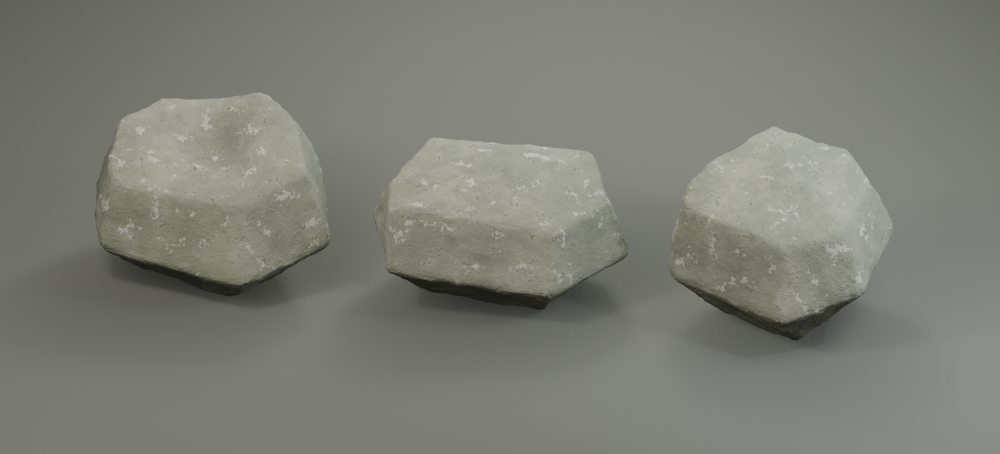

# Rock: three replaceable appearances

[Task 114](../../docs/development/tasks/114-rock-variants-integration.md) integrates this original Blender MCP batch. **A has one irregular central hollow; B and C have solid uneven tops.** All have narrower irregular undersides and sloping fracture faces. The rejected twin cuts and wide, chest-like base are superseded. The source uses the user's photographs as reference; it contains no projected photo pixels.

## Canonical files and specifications

| File | Purpose |
| --- | --- |
| `PhotoRock.blend` | All three editable scenes, control cages, original stone node graphs and packed textures |
| `catalog.json` | One `common_rock` item: name, value, slots, counts, exposure/mass and three stable appearance keys/file references |
| `manifest.json` | Exact source dimensions, mesh budgets, map channels and source-to-game pivot convention |
| `variants/{a,b,c}/models/ordinary_weathered_rock.fbx` | One visual mesh per appearance, 12,500 triangles each |
| `variants/{a,b,c}/collisions/ordinary_weathered_rock.fbx` | Separate 82-triangle convex collision hulls; shallow surface detail is intentionally spanned |
| `variants/{a,b,c}/textures/Rock_{BaseColor,Normal,Masks}.png` | Three 2048px 8-bit maps per appearance; original stone colors/grain/weathering |
| `variants/{a,b,c}/previews/{hero,front,rear,top}.png` | Final baked-material views, with staging excluded from exports |
| `create_photo_rock.py`, `validate_photo_rock.py`, `validation.json` | Reproducible Blender recipe and saved-source/FBX checks |

Estimated Blender width/depth/height: A **70/55/45 cm**, B **72/51/39 cm**, C **61/54/46 cm**. These are adjustable game sizes, not measured photogrammetry. Source units are metres and the pivot is at base centre. Unity imports Y-up and recentres visual/collision meshes together around their bounds for safe arbitrary rotation; every appearance fits within the 0.5 m placement radius.

## Current game contract

There is **one Rock catalog entry**, with three equally likely appearances and seeded full 3D spawn rotations. Each rock is **1 credit, 1 inventory slot, common, detector-silent and 60% exposed before pickup**. `115` restores aimed digging assist on covered rocks and adds 0.6 seconds of eligible observation before held/toggle auto-collection. RMB lifts/drops the physical object; a fresh Dig press throws it. Catalog `throw_speed` starts at 4 m/s. Detached rocks fall/tip/settle; 12 kg is simulation tuning, not a measured real-world mass.

New games contain 48 rocks and 144 bottles after [126](../../docs/development/tasks/126-shallow-find-density.md). The 120 shallow finds include 24 rocks and 96 bottles; another 24 rocks and 48 bottles populate the deeper pool. Existing saves retain their populations. Stable appearance keys `common_rock_a`, `common_rock_b`, `common_rock_c` preserve geometry choice and saved pose in save v3; these keys are visual variants of the same item, not rarity/value categories. Style, counts/value and subjective feel remain trial tuning.

## Editing, replacement and sync

Open `PhotoRock.blend` and select `SDT_PhotoRock_{A,B,C}_Studio`. Each contains `_Rock`, hidden `_EditableControlCage`, hidden `_Collision`, `_EditableStone` node graph and `_BakedStone` material. The cage is an editable starting form, not a live modifier controller. Studio camera/floor/lights are preview staging only.

To regenerate through Blender MCP, load the recipe into a namespace with `__file__` pointing to it. For each index 0-2 call `use_variant(index)`, then `studio()` only when the scene does not exist. `rebuild_variant_geometry()` deliberately replaces that variant's geometry/cage/collider with the recipe version: preserve intentional manual edits first. For manual mesh edits, rebuild the corresponding collision mesh and UVs as needed instead of regenerating the visual.

For each changed appearance, call `bake(channel)` for `BaseColor`, `Normal`, `Masks`, then `preview(view, baked=True)` for the four views (hero last), and `export()`. Finish with `save_batch()`, `render_lineup()` and the validator's `validate()`. Sync changed dimensions/triangle expectations in `catalog.json`, `manifest.json` and validation when deliberately changing their contract; visually inspect the result before accepting new expectations.

In Unity, **Tools > Something Down There > Sync Rock Models** reads this catalog and rebuilds derived assets under `Assets/Content/PhotoRocks/` while preserving existing `.meta` references. It also runs the existing bottle sync so the shared catalog remains complete. Both this menu and **Sync Starter Find Models** include the rock entry. `PhotoRockSetup.cs` owns rock selection; `StarterFindSetup.cs` supplies shared import/sample/material mechanics. BaseColor is sRGB; Normal is imported as a normal map; RGB metallic/AO/roughness becomes Unity metallic/AO/smoothness with `alpha = 1 - B`.

Keep appearance/save keys and imported `.meta` files stable when replacing models. Replace visual mesh, collision hull, maps and exposure samples together, then validate random-rotation clearance, buried recognition, support/pickup and save reload. Update this guide/manifest if dimensions or file references change. Gameplay numbers belong only in `catalog.json`; do not hand-edit them into generated prefabs.

## Ownership and removal

Original source and all derived source outputs are recursively owned by `art/photo-rock/`; imported Unity files/metas are isolated under `Assets/Content/PhotoRocks/` plus its folder meta. The [asset ledger](../../docs/asset-ledger.md) records exact shared hooks, source/license, approval and safe removal. Preserve or explicitly migrate saved appearance keys before removing their prefabs; never wipe a save to hide missing content. Preserve all user photos, terrain, bottle sources/imports and unrelated Blender scenes. Original-asset commercial permission is in `LICENSE.txt`.
