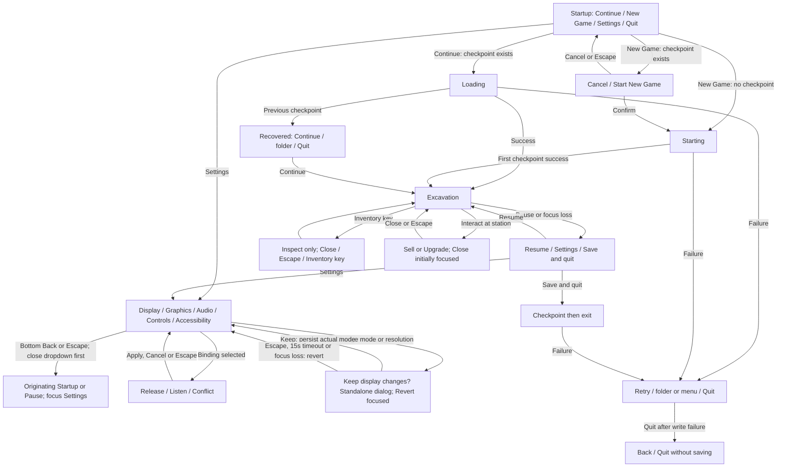

# Implemented navigation

User request: consistent ordering, categorized settings and concise copy. Theme: [107](../tasks/107-ui-ux-cleanup.md); current [settings](common-settings.md) in `123`. Exact strings and conditions: [catalog](catalog.csv).

No dead-end destructive state: safe Cancel/Back remains visible on confirmations; load failure never starts a replacement world. Waiting screens intentionally block actions until an asynchronous result. Development-only admin/reset branches are cataloged separately and remain unavailable in release.
