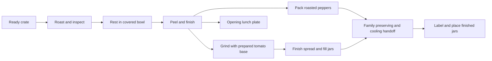

> Archived roasting-focused proposal. Superseded by the [current bulk-clearing design](../../readme.md). Historical ideas and test proposals below are not current requirements.

# Core loop and mechanics

[Design index](readme.md) · proposed behavior, not implemented functionality

**The player learns when a pepper is ready and how to keep a small outdoor work area flowing.** Repetition earns a rhythm; batch tools protect that rhythm from unnecessary carrying and clicking. The [research](research-and-authenticity.md) explains the real process. All seconds and capacities below are provisional game values.

## One complete batch

1. Read a short job card: quantity, product, and recipient. Accept the finite batch.
2. Take a pepper from the crate and insert it into an available roaster socket.
3. Listen and glance while doing another useful action. Lift to inspect when appropriate; remove when the skin and softness look right.
4. Put roasted peppers into an open bowl. Close it when ready to rest that batch.
5. Open the rested bowl, peel with broad movements, and finish the core/seeds in one forgiving action.
6. Pack the requested product. Carry the completed batch to the family handoff rack.
7. A short transition resolves preserving and cooling. Label the finished jars, place them on the marked shelf or parcel tray, and see the completed work.

The player can stop between jobs. A job never changes its requirements after acceptance. Ambient dialogue is not an instruction source the player must remember.

## Roasting: the proposed main skill

Insertion and retrieval use generous targets. A brief tong motion handles the lid automatically; lid placement is not a separate repeated chore. A lift-to-inspect action raises the pepper into view and pauses its heating. The player can keep it or return it without resetting progress. Other loaded peppers continue cooking unless the whole game is paused.

| Readable condition | Player interpretation | Useful action |
| --- | --- | --- |
| Smooth, firm surface; little blistering | Needs more roasting. | Return it or let it continue. |
| Blisters spreading; skin darkens; body begins to soften | Approaching readiness. | Finish a nearby action, then inspect. |
| Lifted skin and softened form; healthy flesh beneath | Good roast. | Transfer to the bowl. |
| Excessively collapsed body; visibly scorched flesh on inspection | Quality has been lost. | Remove and use the recovery route. |

Skin color alone never determines success. At least two visual features, an audio cue, and optional text assistance communicate readiness. Do not require smell or pretend the player can see through a closed appliance.

Start future tuning around **18–24 seconds to a good roast with at least 12 seconds of grace** for the ordinary pepper. A faster thin variant and a slower thick variant can follow only after the normal one is understood. Exact timing must leave room for transfers and peeling. These are not cooking instructions and do not alter the existing Stage 0 settings.

Loading three peppers is optional. Staggering them can create a pleasant sequence; loading them together creates a small removal burst. Neither approach should be a trap. At maximum planned capacity, removing all three with ordinary input must comfortably fit within the grace window.

A curved-pepper variation may show one pale contact area and invite **one** reposition. No repetitive rotation meter, hidden heat simulation, mandatory precision flip, or random invisible defect. If that variation feels like busywork, cut it and keep the two timing families.

## Covered bowls: make a real batch decision

An open bowl accepts roasted peppers. Closing it starts a short rest, initially about eight game seconds. The batch then stays ready until the player returns: it cannot become “over-steamed” because they attended the roaster.

New peppers cannot enter a closed batch. The player can deliberately reopen early, cancelling that rest attempt without damaging the peppers, then close it again. The prompt explains the consequence. A second bowl later allows one batch to rest while another receives peppers. Start with room for three; expand to six only with the corresponding campaign reward.

On opening, a restrained steam burst reveals the peppers. This is a payoff and a state cue. It must not hide the targets long enough to interrupt work.

## Peeling: keep the reveal, reduce the tax

The default candidate uses two broad pulls on a supported pepper, followed by one combined core/seed cleanup motion. Aim for roughly three to five seconds of deliberate input after learning it. The pepper responds continuously; partial work remains when the player lets go. No tiny fragments, repeated scrubbing, or hunting the last seed.

Peeling happens on a tray, so the player can leave it immediately to retrieve a roast. A miss does not tear the pepper automatically. The optional “intact presentation” distinction comes from clear authored conditions, not punitive mouse precision.

After the basic action is learned, a **batch-assist option** lets the player finish one representative pepper and hand the rest of that bowl to Grandpa for the same visible finishing treatment. This is a proposed household shortcut, not a claim that shaking a pot realistically peels everything. It must complete the whole announced batch without repeated confirmation. Manual peeling remains available for anyone who enjoys it.

Do not build autonomous Grandpa behavior to support this: a fixed seated station, a brief handoff, and a returned tray suffice. The [validation plan](scope-and-validation.md) determines whether this feature is necessary or whether a short manual peel remains enjoyable on its own.

## Jar packing: the second major tactile reward

Use one standard jar silhouette. For tuning, **three prepared pepper units fill one jar**. This is an abstract game yield; actual pepper sizes and recipes vary. The opening lunch plate is the only required non-jar destination.

Early packing: place each prepared pepper into the wide mouth, watch an authored fold settle it inside, then snap the lid into place. After learning that action, a tray-to-jar transfer places the same three units in one short sequence. Do not make the player individually compress food through a collision puzzle.

Filled jars go on the **“For preserving”** rack. When the complete job is handed over, an explicit short passage of time returns the processed, cooled batch on the adjacent **“Ready to label”** rack. The game's completion mark appears only then. Label and destination are readable before placement; wrong labels can be changed without opening the jar.

Packing is not a second dirt-removal game. Empty jars arrive prepared. Washing, measuring salt, topping up liquid, preserving temperatures, and cooling waits remain outside the interactive loop.

Finished shelves hold real-looking jar rows. If food goes to a family member, the matching packed box remains in view until the ending, preserving the before/after comparison.

## Lyutenitsa: one bounded late-game branch

This branch earns a place only if it adds an enjoyable material transformation. It is the first candidate for removal if the game becomes too large.

1. Pour a prepared pepper tray into the hand grinder. A short hold or a few broad handle movements produce textured mash; provide a toggle alternative to holding.
2. Add one supplied, pre-portioned tomato base. No ingredient shop or recipe arithmetic.
3. Transfer to the finishing pan. Perform a few broad spoon sweeps; the mixture visibly thickens and briefly holds a trail. The proposed interaction is about reading consistency, not several minutes of stirring.
4. Use a broad ladle/funnel target to fill jars, then use the same preserving handoff, labeling, and storage rules as roasted peppers.

Only one batch occupies the grinder/pan set at a time. The pan is taken off active heat automatically when the player leaves it, so it adds no second urgent cooking clock. Reusing the three-pepper-units-per-jar conversion keeps job accounting understandable; it is expressly not a recipe ratio.

Grinder, thickening, and filling together should remain a brief punctuation to a batch. If players only tolerate these steps to see the jars, compress them into one handoff or remove the branch. More stations are not inherently more fun.

## Quality and recovery

| Outcome | Recovery | Consequence |
| --- | --- | --- |
| Removed too early | Return to the roaster with progress retained. | A little extra work; no lost pepper. |
| Well roasted and intact | Any requested product; presentation bonus where offered. | Attractive result. |
| Well roasted but torn | Ordinary jar or lyutenitsa, depending on job. | Still useful; optional whole-pepper bonus may be missed. |
| Burnt flesh | Put in a clearly marked scrap pail; obtain one replacement from the reserve crate. | Cosmetic waste tally and lost optional bonus, never a blocked main job. |
| Wrong label or destination | Relabel or retrieve before final handoff. | No destruction or replay of cooking. |
| Misplaced held item | Cancel returns it to its last valid spot. | No food hunt under furniture. |

The story provides enough ordinary ingredients, jars, and replacement peppers to finish. Replacements are available on demand without earning money first; they are not an endlessly spawning pile. Optional quality rewards cannot fund a mandatory unlock that a struggling player would then miss.

## Rhythm and input contract

At most **three urgent roasting sockets** operate in the proposed small game. Bowls and finished food wait safely. The sequence should allow: inspect a roast → fill the receiving bowl → refill a socket → peel or pack → return to the next roast. If it instead requires constant frantic switching, widen timing windows before adding more automation.

One primary contextual action handles taking, placing, inspecting, and using a broad work surface. A consistent cancel action returns held objects. Tool changes are contextual; no hotbar juggling. Instructions, pause, and menus stop all work timers. A comfort option slows roasting without reducing rewards.

At job boundaries, the player can rearrange stations among a small number of approved table positions. During a job, work surfaces stay fixed. This makes layout choice useful without requiring free-building physics or making a hot appliance awkward to move.
