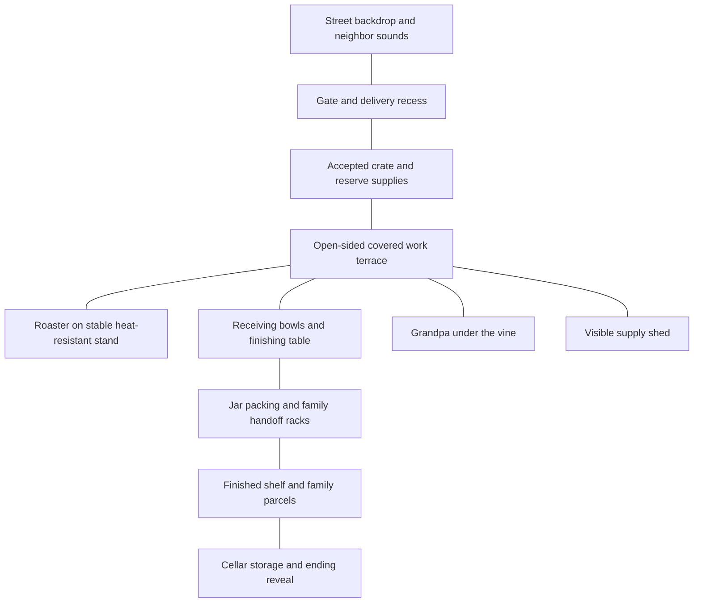

> Archived roasting-focused proposal. Superseded by the [current bulk-clearing design](../../readme.md). Historical ideas and test proposals below are not current requirements.

# One yard, a season of progress

[Design index](readme.md) · proposed campaign and tuning targets

The yard should become a place the player knows by hand: crate on the left, roaster ahead, bowl beside it, finished food on the right. Progress improves this familiar arrangement and changes what occupies the space.

## Outdoor layout

This is one compact playable property. The street is scenery beyond the gate. Roasting, resting, peeling, grinding, and packing all stay outside. The roof gives a dry working area while open sides preserve sky, air, and neighborhood sound. Smoke rises into open space; no indoor kitchen becomes the main workshop.

Place ordinary working targets within a few steps of one another. The shed reveals supplies at milestones, with no lock-picking or obstacle course. The cellar opens for the ending and contains a small readable storage alcove, not a basement exploration level. Its door should be visible early, but it must not obstruct normal jar storage.

Allow two or three table-position presets at job boundaries. A player can bring the jar tray closer or put the receiving bowl on their preferred side. Show the benefit directly: fewer turns or shorter transfers. Do not make decoration a prerequisite for efficient work.

## Campaign shape

The baseline is **eight main jobs across five short chapters**, using the [job table](jobs-events-and-comedy.md) as the source of quantities. The starting budget is 78 peppers: three for lunch and 75 producing 25 game jars. Reserve replacements and optional jobs are outside that count. These small quantities represent a larger family workday; the original “500 peppers” idea is not a promise of 500 individual interactions.

| Chapter | Jobs | New experience | Visible change |
| --- | --- | --- | --- |
| 1. Only a few | J1–J2 | Learn a whole pepper and finish the first jars. | Lunch plate, first shelf row, two emptied crates. |
| 2. The good machine | J3–J4 | Use three sockets, then alternate covered bowls. | Triple roaster revealed; organized receiving area. |
| 3. Family specifications | J5–J6 | Read two pepper timing families; label two recipients' food. | Separate family parcels and a much clearer worktable. |
| 4. The family recipe | J7 | Turn peppers into one lyutenitsa recipe if its test succeeds. | New texture, sound, and jar contents. |
| 5. These really are the last | J8 | Combine learned actions into a final mixed delivery. | Empty accepted-crate area, complete shelf/parcel display, cellar opens. |

Initial design target: roughly **45–90 minutes for a first campaign**, subject to observation. The quantities do not demonstrate that duration. If enjoyable work runs shorter, shorten the game or add a genuinely different job; do not slow roasting, add forced waits, or multiply crates to meet a playtime label. Optional remixes can add sessions after the ending without becoming required campaign work.

## Upgrades must change the player's day

Rewards come from main-job milestones, not a mandatory money grind. Essential capacity is earned for finishing, including imperfect finishes. Optional quality rewards are labels, display items, or a congratulatory line.

| Available after | Upgrade | Chore or limitation addressed | What the player still decides |
| --- | --- | --- | --- |
| J1 | Clear jar-packing space and first shelf | Finished peppers need a destination. | How to place and finish the first jars. |
| J2 | Replace single roaster with the visible three-socket model | One-at-a-time throughput is understood. | Loading rhythm and removal timing. |
| J3 | Second covered bowl; paired capacity rises from three to six per bowl | One closed bowl blocks the next batch. | When to close and alternate batches. |
| J4 | Tray transfer and optional Grandpa peeling assistance | Repeated individual transfers/peels may dominate. | Roast quality and product routing. |
| J5 | Label guide and two clearly marked parcel positions | Recalling recipients adds needless memory load. | Matching completed food to the current request. |
| J6 | Grinder and finishing pan, conditional on validation | Adds a new use for prepared peppers. | Product allocation and reading consistency. |
| J8 | Pantry reveal and replay access | Gives the work an ending. | Whether to do another optional batch. |

The single-slot roaster becomes a keepsake on the shed shelf. Do not let both machines create four urgent sockets in the baseline. The change to the triple roaster should have a satisfying reveal and a chance to inspect it before loading starts.

Tray transfer must actually transfer a tray's announced contents. Grandpa assistance must finish the announced remainder. Avoid upgrades that sound automatic but still demand a confirmation on every item. The same job should require fewer support actions after the upgrade; measure this rather than assuming it.

## Rewards without an accounting game

The job board records completed family needs, not a corporate order queue. There is no rent, hunger, electricity bill, or ingredient bankruptcy. Main milestones grant necessary tools directly.

Optional “nicely done” marks reward intact presentation or low waste. They can unlock a jar label, a painted tool hook, or a small framed campaign photo. They never gate the final chapter. The only proposed collection is a small set of **photos of odd peppers**, taken before processing; collecting cannot consume an essential ingredient.

The main reward remains visible food. Some jars stay on shelves; others sit in open family boxes until the final handover. Progress must remain readable even when a particular job's food is intended to leave the property.

## Fair escalation and closure

The board shows eight chapter jobs from the start, with upcoming recipe details revealed gradually. Once a job is accepted, its displayed quantity is fixed. Grandpa can joke about how little is left, but he cannot secretly rewrite that counter.

A newly revealed sack belongs to an upcoming listed job or an explicitly optional favor. It never refills the crate the player just emptied. Reveal the joke before the player commits to that next batch, then give them the promised capacity benefit.

J8 is visibly marked as the last main job. Complete it, see the packed winter supply, open the cellar, and get the ending. Further neighborhood favors belong to replay and can be declined without changing the ending.

Progress should survive quitting during a job: preserve food states, bowl contents, completed jars, and the current request. Menus and inactivity pauses stop cooking. These are player-facing expectations for any future implementation, not a request to build saving now.
