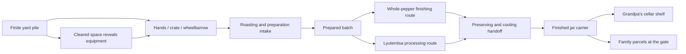

# Core loop and mechanics

[Design index](readme.md) · Just a few peppers · household winter-preparation proposal · no implementation in this task

**Choose a promising pile, gather a satisfying load, tip it into the right intake, collect finished food, and uncover something useful.** The immediate pleasure must come from gathering and dumping. Machines add spectacle and turn removal into useful food for Grandpa and the family. The same carry/place actions also return a jar carrier and reclaim the table. [Household readiness and parcels](household-readiness-and-parcels.md) defines those bounded tasks and the overall ending.

## Where the playtime belongs

Aim for roughly 80–90% or more of active play to come from pepper handling, useful equipment discoveries, route choices, processing transfers, and visible food storage. The grinder and cellar belong to this loop when they change a batch's transformation or destination. Every repeated manual step still has to earn its place.

Household tasks briefly punctuate that work. Their [pacing limit](household-readiness-and-parcels.md#pacing-limits-and-later-evaluation) is a 2–3 minute target and a hard ceiling below five minutes of additional required handling across the campaign. More pepper time is fine; there is no quota to fill with chores.

Do not prescribe uninterrupted 20-minute clearing blocks or an alternating pepper/jar/table checklist. Let a partly exposed tool, a newly opened route, a larger dump, and a changed view provide variety within the main activity. If repeated carrying becomes dull, revise the action, layout, or supply budget. Extra errands and longer machine waits do not solve that problem.

## One complete load

1. Approach a reachable pile face. The next useful object may already be partly visible beneath it.
2. Gather into the currently equipped carrier with a broad action. The source shrinks where the action happens.
3. Take the load to a compatible intake and tip it with one deliberate movement.
4. The line runs automatically. Continue gathering, uncover equipment, or collect an earlier finished batch.
5. After the grinder is found, choose the whole-pepper or lyutenitsa route for a prepared batch. Normal stock defaults to the whole route; sound misshapen stock goes to the spread route.
6. Collect finished jars in a carrier and allocate them to Grandpa's shelf bays or either family parcel. Jars visibly settle into the destination in one short sequence. Until finishing the day, food can be retrieved and reassigned without reprocessing.

Returned jars and table props use the same generous pickup/placement rules, with different compatible destinations. They do not enter the pepper-processing line or add a second recurring supply loop.

There is no recurring inspection, burn window, peel minigame, stirring challenge, or jar-by-jar labeling requirement. One optional brief opening demonstration can show a pepper roasting and its skin coming away. Subsequent play uses loads.

## Gathering must feel physical

With hands, one action takes up to two peppers from a generous target area. Give the player a crate after only a few transfers. The proposed first upgrade should arrive within the opening two minutes, preferably much sooner.

With the crate, hold or toggle a broad scoop action across an exposed pile surface. Short scoops lift small groups into the crate until its visible capacity of 12 is reached. Each scoop changes the local silhouette and reveals ground or a buried edge. Do not make the player click twelve separate peppers or fill a bar while the pile remains visually identical.

The wheelbarrow holds 48 pepper units. A wider gather action moves larger clumps and supports a clear fourfold load increase over the crate. It does not suck an entire courtyard through walls. Gathering remains local to its generous front collection area.

All capacities are provisional game units. The visual pile can contain decorative peppers beyond the exact selectable units, but its remaining volume and tool response must agree. A dense pile shell, several authored depletion stages, and a limited number of moving peppers are candidate representations. The expensive uncertainty is whether the resulting scoop looks responsive enough; do not promise full individual physics.

## Carrying and tipping

The crate leaves the forward view clear. The wheelbarrow is attached to a stable movement pose with a generous collision shape; it does not require vehicle steering, balancing, stamina, or wheel-by-wheel terrain simulation. Ordinary paths must fit it comfortably. Turning in place and reversing should be easy.

At an intake, show the accepted amount before tipping. A broad tip action tilts the carrier and releases a short cascade, with pepper impacts and a satisfying empty-container finish. Cancel preserves the untransferred remainder. An intake with room for 18 accepts 18 from a 48-unit load, leaving 30 in the carrier. Never discard the excess.

A compatible destination is always clearly marked. If the player cancels carrying, the container returns to a valid nearby resting position. Decorative spill motion cannot lose food under the world. Retrieving a stuck carrier returns its existing contents; it never creates a replacement load.

The empty return walk should be short. Clearing opens a route that can shorten later trips, and the player can bring jar carriers toward storage on a return leg. Do not require optimal logistics to finish.

## Processing is a destination with a readable sequence

The single-slot chushkopek is an opening joke and a short demonstration. A supplied feed tray handles queued material automatically. The three-slot appliance still visibly contains three roasting positions; a fictional loading rack feeds a container through several compressed cycles. Its chamber does not suddenly contain 48 peppers.

The line depicts roasting, covered resting, and preparation through a few short visible motions. A fixed family workbench handles peeling/cleaning through a batch handoff. This does not require a wandering helper or a detailed animation for every pepper.

The [three authored equipment stages](yard-and-progression.md#grandpas-three-equipment-stages) give this automatic sequence a growing personality: familiar appliance, Grandpa's loading modification, then the oversized homemade processor. They use the same outdoor station and broad intake/output controls. Discoveries install equipment through one short authored activation or swap; there is no assembly, maintenance, or fuel-management loop. The single-slot opening demonstration is a brief prop moment, not another full upgrade tier.

The whole-pepper route goes through packing and a compressed preserving/cooling handoff. The lyutenitsa route visibly produces mash, then uses an adjoining cooking/finishing enclosure and the same preserving handoff. No recipe ratios or preserving instructions are simulated. [Authenticity boundaries](research-and-authenticity.md) separate real processes from invented apparatus.

Finished food waits indefinitely without burning, spoiling, or losing quality. If no compatible output space remains, the machine stops safely and displays **Output full**. A completion sound invites collection; it is not an alarm demanding an immediate response.

## Finite capacity without machine babysitting

Each active route has one visible input buffer, one processing batch, and one finished-carrier position. Buffer and output capacities grow with the handling tier: initially 12, then 48 alongside the wheelbarrow, then 96 on the final machine. These are total feed/output capacities, not the number of peppers simultaneously inside a real chushkopek.

Accept partial loads and run partial batches. The last few peppers must never require buying or spawning more to reach a batch minimum. Reserve enough output room before a batch starts, so an in-progress transformation always has a destination.

Compatible completed batches can accumulate in the same waiting finished carrier up to its current capacity. At the final tier, a 48-unit result leaves room for another compatible 48-unit result; the player can collect all 96 together or take the first 48 immediately. An occupied output position alone is not a blockage. Keep different product routes in their own carriers and preserve room reserved for active work. No minimum fill or extra packing gesture is required.

Capacity upgrades preserve all queued and finished contents. A front-end replacement takes effect at a cycle boundary with existing work retained; it never resets the line. Keep one active roasting/preparation front end, even if the older appliance remains visible as a keepsake or fallback.

Equipment access remains flexible. Finding the final processor before the wheelbarrow improves the station but leaves the player carrying their existing crate. Discovering the folded 48-unit rack afterward never downgrades the installed 96-unit capacity.

An output pickup takes the whole announced carrier. Reloading and preparation are automatic. Two independent routes can operate after the grinder reveal, but neither creates an urgent timer. Clearly show **Room for load / Working / Output full / Ready to store**.

Tune processing to consume at least the player's ordinary measured delivery rate at that tier. The player should generally find useful completed work on the next visit. A bigger carrier must not merely move the waiting from the yard to the machine.

For a future comparison, process the same 48 units: four crate deliveries versus one wheelbarrow delivery, including gathering, travel, intake acceptance, queue delay, and output storage. Claim an improvement only if the entire sequence improves. Capacity multiplication alone does not demonstrate this.

Later, compare the modified station with the final processor on the same 96 units of compatible stock and the same product route, keeping the wheelbarrow and travel path constant. The final version accepts two loads between collections and supports one larger finished-carrier transfer. Tune throughput and handoffs so this removes support actions and improves the complete job; it cannot compensate by adding peeling, resets, confirmations, or a longer final wait. Assess any shortcut benefit separately so it does not conceal a weak machine upgrade.

## Two useful stock classes

| Stock | Readable distinction | Routing rule |
| --- | --- | --- |
| Normal, sound peppers | Ordinary intact shape; crate tag with whole-pepper symbol. | Either product after the grinder is unlocked; whole route is the default. |
| Sound misshapen peppers or edible pieces | Obvious irregular shape or pieces, with a spread symbol. | Lyutenitsa route. This is usable food, not rot or burning. |

Keep most sources homogeneous. A mixed crate may show two broad tagged compartments, allowing two group transfers without selecting individual peppers. Do not hide a single incompatible pepper among hundreds.

Every approach to the grinder contains only stock the existing line can process. The cellar approach is also clearable with that stock and does not require a completed lyutenitsa batch. Special stock is revealed only when its route is accessible. Avoid a circular requirement where the machine needed to clear a pile is inaccessible behind that pile.

Hot, tiny, and huge variants remain optional candidates in [Objectives and comedy](jobs-events-and-comedy.md). They do not enter the baseline campaign or add compulsory machinery. Odd appearance can also be a photographic keepsake without creating a third functional class.

## Progress must represent the same material

Track the authored supply across yard piles, carried/staged raw stock, processing, finished carriers, temporary storage, Grandpa's shelf stock, and the contents of each family parcel. Taking a load moves it between those places; it does not duplicate it. A cosmetic cascade never owns a second copy.

For an illustrative budget, three pepper-equivalent game units produce one jar. This abstraction applies to both routes and does not specify a real recipe. A route can finish a partly filled final jar; storage credits its actual pepper equivalents. The interface can show a partial finished carrier; do not erase leftovers. Use divisible totals in authored areas, while still allowing partially filled carriers to move. The progression table reports jar equivalents, not a mandatory count of full jars.

**Cleared space** advances when a source pile shrinks. **Food prepared** follows finished output, while **Food allocated** follows placement on Grandpa's shelves or in family parcels. Temporary storage is visibly useful but is not a second copy of the finished stock. Moving food between destinations changes the relevant counts; it never credits another production event.

Resolving the harvest is one part of the broader household goal. The authoritative [finish conditions](household-readiness-and-parcels.md#finish-conditions) also require the returned-jar task, both parcels at the gate, and the prepared table. The player then chooses **Finish the day**. Today's harvest does not have to end entirely in the cellar.

Basic washing, unwanted stems/skin, tomato base, and preserving supplies are compressed into the line; there is no discard economy in the baseline. The one returned-jar carrier has separate ownership and task state, not pepper equivalents or recurring consumption. Existing pantry foods and the final meal are background household stock and do not alter today's harvest accounting. The progress measure follows usable pepper equivalents, not literal whole-food mass or the count of every decorative object.

## Recovery and player choice

Wrong routes reject only incompatible contents and explain why. Before processing begins, queued stock can be retrieved. Once processed, output remains valid food; the main campaign does not demand a fixed ratio of the two products that could be made impossible by earlier choices.

Never respawn cleared piles to replenish a mistake. Recover an existing misplaced load in place, pause work when focus is lost, and preserve partial loads, queues, equipment discoveries, shelf/parcel contents, returned jars, and table placement when quitting. Objectives read current world state: doing a household task before hearing its dialogue counts, and removing food from a ready parcel correctly makes it incomplete again.

The player chooses reachable piles, access routes, when to collect output, and whether a compatible batch goes home or into a family box. After the small gate pocket, the wheelbarrow, shed, and cellar approaches offer different priorities. A few local access dependencies keep equipment reachable; they do not impose a single highlighted-object order. If every trip is predetermined and empty walking dominates, the core design needs revision before more content.
