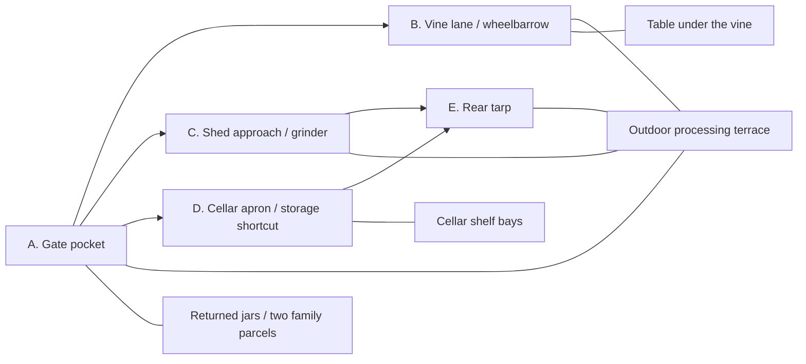

# Yard and progression: a household ready for winter

[Design index](readme.md) · Just a few peppers · household winter-preparation proposal

The opening view contains an absurd problem immediately: packed crates under the vine, sacks against the shed, a heaped wheelbarrow hidden in the mess, and a tarp with a suspicious outline. Grandpa sits beside one small chushkopek. Returned jars occupy a corner of the gate and the table under the vine holds work clutter. The larger objective is **get the household ready for winter**: open the yard, resolve the harvest, allocate food, prepare two family parcels, and reclaim that table.

## One property, five connected areas

Arrows show reachable approaches, not mandatory chapter order. After the short gate opening, the player can clear toward the wheelbarrow, shed, or cellar. Either the shed passage or the cellar-apron path provides access to the rear tarp; both are not required to reach it.

These are sections of one compact map. Crates and piles initially interrupt sightlines and access; clearing exposes more of the same property. The outdoor processing terrace remains accessible throughout. Roasting, preparation, and processing never move into the shed or cellar.

The cellar is a small, initially half-stocked storage space with old preserves and reserved bays for today's food. Before its approach is cleared, a visible outdoor reserve rack holds finished jars. Once open, the player transfers existing reserve stock to shelves or family parcels in batches; it leaves the reserve display and retains its original contents. Parcels can also be filled directly at the gate before the cellar opens. [Household readiness](household-readiness-and-parcels.md) defines allocation and finishing.

The street remains a backdrop at the gate. A single shed bay reveals equipment which is then positioned outside through a short authored placement. No second settlement, basement maze, or indoor cooking level is needed.

## Discovery and dependency order

| Area | Clearable with | Early visible clue | Reward / new capability | Protection against a blocked campaign |
| --- | --- | --- | --- | --- |
| A. Gate pocket | Hands and the starting automatic feed tray. | Edge of an empty plastic crate. | Crate after the first few transfers; triple appliance and loading rack on the processing terrace. | No mandatory roasting judgment; the first useful carrier does not require clearing a huge pile by hand. |
| B. Vine lane | Crate and existing line. | A wheel and handle under a shallow pile section. | Wheelbarrow plus a folding 48-unit feed/output rack found beside it. | Reveal after a small reachable pocket, not after processing the entire lane. |
| C. Shed approach | Crate or wheelbarrow, with the whole-pepper route. | An old refrigerator used as a tool cupboard, visible behind the doorway. | Opens the cupboard to reveal the grinder kit; move it outside in one authored interaction. | Approach contains normal stock. No wheelbarrow unlock or irregular-stock task gates its own required machine. |
| D. Cellar apron | Crate or wheelbarrow and the default route. | Steps, a fabric-covered shelf, and the end of a loading chute. | Cellar access, bulk shelf placement, a shorter hauling path, and one approach to the tarp release. | No grinder requirement. Outdoor storage supports the entire pre-cellar supply; no key can enter a load. |
| E. Rear tarp | Existing line; reached through C or D. | Large covered machine beyond either cleared approach. | Fictional 96-unit processor and chute; use them on the remaining existing supply. | Uncover the upgrade before clearing its demonstration mound. Its default route works without the grinder; irregular stock still waits behind its own compatible access. |

Opening the final tarp reveals both a machine and the last supply area. That supply was authored at the start. The revealed machine replaces the roasting/preparation front end; existing product routes and carrier controls remain familiar. If the grinder has not yet been uncovered, the machine serves the default route until that separate discovery.

Recovering equipment means uncovering it, taking off a cover, and using one clear activation interaction. Do not introduce repair parts, wiring puzzles, or a separate crafting economy. Any cosmetic detached part is beside the device and cannot be consumed elsewhere.

## Grandpa's three equipment stages

These are three authored presentations of the same outdoor station. They make Grandpa's inventiveness visible while reducing the work around each load. They add no new production route or required cooking gesture.

| Stage | Appearance and reveal | Change the player should feel |
| --- | --- | --- |
| Familiar appliance | A recognizable triple chushkopek with a modest automatic feed tray; the tiny single-slot appliance supplies only the opening demonstration. | A full 12-unit crate tips in at once and yields one finished carrier through the supplied preparation/finishing setup. |
| Grandpa's modification | The folded rack found with the wheelbarrow opens into an oversized feed tray, tipping guide, and larger output support. Reused-looking brackets and a worn handle suggest his handiwork. | Accept a 48-unit wheelbarrow load in one broad action; automatic feeding and matching output capacity preserve the saved trips. |
| The tarp reveal | The existing final processor becomes Grandpa's comically substantial homemade solution, installed at the terrace's existing intake/output positions through one authored swap. A wide chute and visible batch movement sell its purpose. | Accept two 48-unit loads between output collections, run them without attention, and move finished food in a carrier supporting 96 units. The whole job becomes easier. |

The stages describe increasing capability, not a new mandatory discovery order. The final machine remains reachable through either C or D before the wheelbarrow if the player chooses; carrier unlocks stay separate and later discoveries cannot reduce installed capacity. Older equipment can remain visible as keepsakes, with one active front end.

The final machine is a visual and mechanical payoff while useful supply remains. Grandpa understates how much equipment he built; the next large dump demonstrates why it matters. An internal moving feed or chute is an authored animation within this station. Player-built conveyors, component assembly, repair errands, and extra workshop locations remain outside scope.

These specific household machines are fictional. Real Bulgarian industrial roasters and peelers provide [mechanical inspiration](research-and-authenticity.md#mechanical-inspiration-for-grandpas-invention); they do not establish that this household setup is a common tradition.

## Capacity should feel disproportionate

| Handling stage | Carry capacity | Feed/output support | Experience |
| --- | --- | --- | --- |
| Hands | Up to 2 units | Starting tray; automatic queued demonstration. | A few small transfers establish the absurd mismatch. |
| Plastic crate | 12 units | 12-unit input/output carriers. | A local pile changes with each load. |
| Wheelbarrow | 48 units | Matching 48-unit buffers and jar carriers. | A familiar quantity takes a quarter as many incoming trips. |
| Final chute and homemade processor | Wheelbarrow remains 48 units; crate works if found first | 96-unit intake/output, accepting two wheelbarrow loads without individual reloads. | A larger continuous processing spectacle and fewer finished-carrier trips. |

The chute is a loading aid, not a fictional inventory-capacity increase for the wheelbarrow. The last upgrade must also improve the measured full workflow. If the existing processor already keeps up, faster processing alone has little value: batch output handling and the newly opened shortcut must provide a visible benefit.

Use the same carrier interaction for food output. A heavy-looking carrier may move comfortably as a game abstraction; do not add lifting penalties after promising convenience.

## Finite supply, honest spatial discovery

Use an authored supply budget rather than surprise refills. An illustrative starting manifest is:

| Area | Pepper-equivalent units | Jar equivalents at the provisional 3:1 game conversion |
| --- | ---: | ---: |
| A | 12 | 4 |
| B | 96 | 32 |
| C | 144 | 48 |
| D | 192 | 64 |
| E | 288 | 96 |
| Total | 732 | 244 |

These numbers budget only the pepper harvest. The two family parcels each receive 12 units from this same supply, leaving 708 units for Grandpa's shelves: 8 parcel jar equivalents plus 236 shelf equivalents. The return-jar setpiece and existing pantry/meal props add no new pepper supply. These numbers are a tuning example, not implemented inventory, a food recipe, a promised duration, or a requirement to render 732 active physics objects. A pile's apparent volume, collection rate, and camera composition need testing together.

The player sees five area silhouettes on a rough property sketch from the start; hidden sections are marked unexplored. Local piles have truthful progress. If showing an overall percentage, calculate it against the fixed total including hidden areas. Alternatively omit the percentage until the whole property is surveyed. Never display a false completion counter and enlarge its denominator later.

Grandpa can underestimate what lies behind a tarp. The game's objective cannot claim that the currently visible pile is the last one until the player reaches the true final area.

## Household acts across the same spaces

These acts describe a likely emotional rhythm, not an enforced list of object clicks:

| Act | Main development | Household meaning |
| --- | --- | --- |
| Just the peppers | Gather, dump, expose the crate. | A small favor already looks larger than promised. |
| While you're here | Choose an upgrade/access pocket; return the jar carrier. | The property contains a family workday, not only raw material. |
| Apparently everyone needs food | Allocate existing output between home and the two parcels; optionally discover lyutenitsa. | The jars support people beyond Grandpa. |
| The machine | Reveal the large processor and use it on remaining supply. | The day's problem becomes manageable with earned capability. |
| Call it a day | Clear the table, finish allocation, and choose the ending. | Work becomes hospitality. |

The table has three movable work props and a cloth. It can be prepared early; the processing terrace uses its own surfaces. No new machinery is required to finish this setpiece.

Keep the added household handling within the [2–3 minute target and under-five-minute ceiling](household-readiness-and-parcels.md#pacing-limits-and-later-evaluation). The acts above describe changes in meaning, not equal-length sections or an enforced sequence of chores. Discoveries and easier handling should vary the pepper work itself; do not author twenty minutes of identical hauling between setpieces.

## Beginning, middle, ending

**Opening:** the clearing target is understandable immediately. One automatic pepper demonstration establishes what comes out of the appliance. Within a few transfers, the crate appears. The ordinary game does not wait for the player to finish a cooking tutorial.

**Middle:** choose whether to pursue the wheelbarrow, open the cellar shortcut, or reach the shed's tool cupboard. Return the jar carrier on a useful trip and begin allocating compatible food to the two named parcels. Discovering the grinder can add a second product if it earns its place. Equipment discoveries are guaranteed authored rewards. Two or three optional keepsakes provide variety without becoming the reason every normal load is worth doing.

**Finale:** expose Grandpa's excessive machine while there is still a meaningful pile to use it on. Resolve the remaining supply, finish the cellar/parcel allocation, and reclaim the vine table. Household tasks completed earlier stay complete; none respawn as last-minute chores. When the household is ready, the player chooses **Finish the day** and the prepared surface becomes the family meal.

Do not introduce an arbitrary wait for the last batch or a collectible hunt after the food is done. Pace processing so the final stock arrives near the end of the last useful hauling sequence.

The old eight-job sequence, 78-pepper budget, and 45–90 minute cooking-campaign target are archived. The new version has no justified duration estimate yet. Measure a representative section before setting total supply or a store-page promise; neither mountains of decoration nor slower machines create worthwhile playtime.

Optional neighborhood favors can appear after the ending. They use fresh explicitly accepted supplies and do not change the completed main-yard record.
