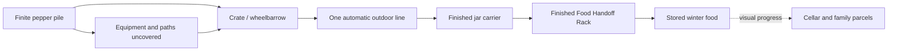

# Core loop and mechanics

[Design index](readme.md) · Just a few peppers · current focused first-game scope · untested

**Gather peppers, dump a load, uncover better equipment, and turn the finite harvest into winter food.** The player uses one processing line, receives roasted-pepper jars, and deposits them at the **Finished Food Handoff Rack** (handoff rack below). The household changes around that work through [presentation driven by progress](household-readiness-and-parcels.md). Deposits move **Winter Supply Progress**; that non-decreasing stored-food total is not upgrade currency. The current prototype uses discovery-only progression.

## One complete load

1. Scoop from a reachable pile face into the crate or wheelbarrow. The pile changes where the action happens.
2. Carry the load to the station and tip it through one broad input.
3. Leave the automatic line working while gathering another load or uncovering a useful route.
4. Collect finished jars as one carrier and deposit them at the clearly marked handoff rack. The player's responsibility for that food ends there.
5. See more winter food in the cellar and family boxes, then choose the next reachable pile.

All sound peppers use the same input and produce the same roasted-pepper jars. Shape and color variations are cosmetic. There is no sorting, recipe selection, grinder branch, manual peeling, burn judgment, parcel allocation, or table task.

## Gathering and dumping carry the game

The crate is available immediately at the gate and holds a provisional 12 pepper units. Begin with bulk handling; the small chushkopek beside Grandpa establishes the scale joke without a separate hand-picking or cooking tutorial.

Hold or toggle a broad scoop across the pile surface. Each short scoop lifts a group, changes the local silhouette, and makes ground or an equipment edge visible. Avoid individual clicks and a progress bar over a motionless heap.

Tune the whole carrier rhythm together: gather time, loaded travel, dump interaction, unavoidable waiting, output handling, and empty return travel. Early loops should feel like clearing is the player-owned work. If filling the crate takes only a few seconds and walking/servicing dominates, increase useful capacity, shorten service/travel, coordinate buffers, or bring the improvement forward. Never slow the satisfying scoop or add delay merely to improve a ratio.

The wheelbarrow holds 48 units and gathers wider clumps. It uses a stable movement pose with easy turning and reversing. Generous paths and clear forward vision matter more than realistic weight or wheel physics. No driving, balancing, or stamina mechanic is required.

Tipping tilts the carrier and releases a short, substantial cascade. An intake with room for 18 accepts 18 from a 48-unit load and leaves 30 in the carrier. Cancellation preserves the amount already transferred and the remaining contents.

When a player clears a substantial pocket or reveals an authoring marker, that pocket should produce an immediate visible payoff: access opens, a route shortens, or the next useful equipment becomes readable. Enable equipment when its small access pocket is physically exposed; do not add a hidden stored-food quota or price after the reveal.

Start with authored pile depletion and a limited pool of moving pepper visuals. The visible volume must agree with remaining contents, but every decorative pepper need not be a separate simulated object. Whether this representation feels good is the main prototype uncertainty.

## One line with three equipment stages

[Grandpa's three equipment stages](yard-and-progression.md#grandpas-three-equipment-stages) share one logical input, product, controls, and outdoor station. Their proposed feed/output capacities are 12, 48, and 96 units. The final station supports two wheelbarrow loads between output collections; it does not increase the wheelbarrow's own 48-unit capacity. Its authored fixed intake extends close to the final pepper supply, substantially shortening loaded travel while feeding the same station. The player still scoops, carries, and dumps at one broad active intake; no additional carrier, powered clearing tool, route-building control, or player verb is introduced.

A recognizable chushkopek and fictional feeder show roasting, covered resting, preparation, packing, and a compressed preserving/cooling handoff. These are short automatic visual stages of one process. There are no player-operated intermediate bowls, prepared-stock inventories, supplied-ingredient meters, or helper schedules. [Research and authenticity](research-and-authenticity.md) explains the real transformations and fictional hardware.

The station has one input buffer, one active batch, and one accumulating finished output. Start partial batches automatically when output space is available, reserving that space before processing. A few remaining peppers never require a minimum batch, a full jar, or additional supplies.

Finished batches accumulate up to the output capacity. At the 96-unit tier, two 48-unit results can be collected together; the first 48 can also be collected earlier. A partly filled output is usable space. At full output, processing pauses safely until collection. Food never burns, spoils, or loses quality while waiting.

Use one reusable finished-food carrier. It takes the available output in one pickup. While it is away, new finished food may accumulate at the station up to the same output limit. Depositing empties the carried contents and returns the empty carrier automatically to its station dock; there is no empty-container errand. The raw carrier parks safely while the player handles finished food. No additional output carriers are spawned.

Equipment activation is one authored installation at a cycle boundary with existing contents retained. Tool upgrades preserve any raw load. Keep the highest station tier already found; discovering a smaller rack later cannot downgrade it. Older equipment becomes scenery.

## One storage handoff

The **Finished Food Handoff Rack** is accessible from the start, near the station's finished-output dock, and accepts every finished batch. This fictional handoff is the sole permanent deposit target for the entire game and has capacity for the full authored harvest. Its label and deposit feedback communicate that household distribution happens automatically after the handoff. Opening the cellar or a shortcut changes access and views, not the destination or storage rules.

A deposit moves the whole carried amount into **stored winter food** once. It is a completion handoff: stored jars cannot be retrieved, relocated, or packed again. There is no temporary rack to clear later and no separate Grandpa/Aunt/city inventory.

The cellar and parcels are visual displays of this one stored total. The player never carries food from the rack to them. They are not additional sources of food, storage targets, or inventories, and no helper NPC transports jars. [Household presentation](household-readiness-and-parcels.md) specifies their relationship to progress.

## Upgrades must improve the whole job

Measure gathering, loaded travel, tipping, processing delays, output handling, and empty walking together. Processing should keep up with ordinary delivery at each tier, and output transfers should fit short useful trips. A debug rate may report active-scooping throughput or end-to-end stored units, but its definition must be explicit, paused time excluded, and no target number invented. A small optional player-facing rate readout may be evaluated later.

Compare the same 48-unit job with the crate and wheelbarrow. Four times the carrying capacity is not proof of four times the overall speed. Later, compare the modified and final stations on the same 96 units from the same final-supply location, using the same wheelbarrow and handoff rack. Include the final tier's nearby intake route in the upgraded layout. The final machine must substantially reduce loaded travel and measurably reduce total time from the first scoop to the last deposit, including finished-output handling and empty return walking. A capacity-only comparison on an artificially identical path is insufficient. Use the [final-upgrade measurement contract](scope-and-validation.md#later-checks-for-the-complete-game).

Useful reveals, changing pile shapes, larger dumps, and shorter routes provide variety. There are no fixed 20-minute clearing blocks or household chores between them. If ordinary repetition is dull, improve the interaction or reduce the supply; extra errands and longer timers cannot repair it.

## Minimal progress and recovery

Keep one fixed harvest total. Its units are distributed across remaining piles, the raw carrier, queued/active processing, available finished output, the carried finished load, and stored winter food. Transfers move existing units; decorative motion and household displays never create another copy.

A provisional three pepper units per visible jar is an art/balancing abstraction. Preserve exact pepper-unit credit for partial final output; the display can show an incomplete group. Do not require every carrier or jar to be full.

Recover a stuck carrier with its existing contents at a valid resting point. Invalid drops cannot scatter required food under the world. Deposits cannot be repeated for more credit. Pause during menus or lost focus, and save remaining supply, carrier contents, processing progress, equipment discoveries, stored total, and whether harvest completion has been committed. Household visuals are rebuilt from that progress rather than separately saved task checklists. A developer session reset returns authored test state; player unstuck recovery preserves earned work and all carried units.

When all supply is cleared and all harvest has reached the handoff rack, the final valid deposit commits harvest completion and gives a quiet, nonmodal acknowledgement. Camera and movement stay available in the completed yard; machines idle naturally, completed displays remain visible, and normal pause/menu controls provide the way out. Equipment discoveries, parcel props, table appearance, and an extra button add no completion requirements. See the authoritative [finish conditions](household-readiness-and-parcels.md#finish-conditions). The M1–M2 interaction prototype verifies complete storage only; it does not require later household presentation.

