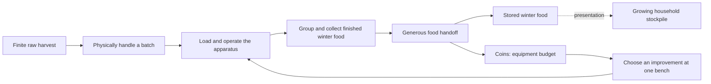

# Core loop and mechanics

[Design index](readme.md) · current processing-and-inventions direction · implementation evidence remains in the queue

**Help Grandpa prepare an unreasonable amount of winter food using increasingly absurd homemade machinery.** Food is the objective, equipment improvements provide progression, and physical handling makes the work enjoyable. Most of the small outdoor yard is walkable from the beginning. Its supplies diminish because the player uses them.

## One complete load

1. Pick up one intended pepper or deliberately gather several from reachable supplies into a freely handled carrier.
2. Pour into a generous feeder, then operate a substantial handle or rack that responds directly to input.
3. Let compressed internal processing finish safely while staging the next batch nearby or playing with loose props.
4. Help group prepared food into a neat finished batch within output collection, then place the finished carrier into the broad Finished Food Handoff Rack area. Stored food and Coins increase once for the accepted units.
5. Choose a visible equipment improvement at the nearby bench, attach the assisted-loading kit if chosen, and use the improvement repeatedly on the remaining harvest.

Keep only a few enjoyable whole-batch actions. Roasting judgment, individual peeling, label sorting, and ten-step cooking routines are not required. Today's prototype product is roasted-pepper jars; [additional food activities](scope-and-validation.md#additional-processing-activities) are separate future decisions.

## Pick up, place, and play

The yard is a place to handle things and make room for yourself. Pick up portable objects, choose where to put them, arrange temporary loads, and take useful shortcuts. This applies to the crate, finished-food carrier, and ordinary loose yard props; the wheelbarrow shares the placement freedom with assisted pushing controls.

- **Choose the position.** Place objects within reach on ground, worktops, shelves, or other objects with enough support and clearance. Surface geometry determines whether they fit; named mats, highlighted sockets, or a hidden surface whitelist do not grant permission. Rotate before placing and make stable stacks. An optional alignment assist may help at the chosen position without pulling the object to a compulsory spot.
- **Make ordinary release physical.** Grabbing and releasing should let the object fall, collide, slide, roll and settle from its hand position, including above the ground without a supported placement pose. Small loose props can also be deliberately tossed. A ball must not be forced motionless by the usual release action; a still ball on level ground need not move artificially. Careful set-down remains useful for boxes and loaded carriers, without throwing or overriding ordinary physical release. Holding an object must not drive it through walls or launch the player. Explain actual obstructions briefly after a rejected assisted placement attempt. Keep placement outlines and continuous valid/blocked guidance hidden for now, following playtester feedback.
- **Make the workspace yours.** Leave a loaded carrier nearby, move a loose basin or stool out of the way, make a temporary stack, or play with a ball while the line works. Use the same grab/place controls for comparable objects. Portable props have no required arrangement, collection counter, reward, or household chore attached. Using supplies makes space and may expose an incidental amusing object; mandatory cleared passages and buried equipment do not drive progression.
- **Let access be physical.** Choose reachable pile faces, staging locations, and routes. Walking around or over a cleared obstacle is a valid shortcut. Most of the yard and all essential work locations are accessible from the start. Equipment improvements are purchased at the nearby bench; reaching or uncovering a prop does not award an upgrade. Yard boundaries and visibly attached fixtures still have ordinary collision. Large installed machinery stays fixed; loose handheld objects should not look grabbable and then arbitrarily refuse interaction.
- **Protect the food, keep the motion.** The model owns carrier contents and exact transfers while physics can own released object motion. Task 1_07 replaces the earlier retained-bulk-load shortcut with registered physical peppers: toppling and off-target pours can spill the same units into loose ownership. Careful placement should not force a spill. Neither pepper bodies nor broken glass can scatter required progress into an unrecoverable scavenger hunt. A lost or stuck object recovers with its existing identity and contents; one recovery gesture regroups pepper strays at their original supply. Authored recovery points are fallbacks, not the only legal places to put things.

Grabbing/place guidance should be contextual and predictable: broad targets, a readable held object, rotation help when useful, and one clear release action. Preserve hold-left-mouse bulk gathering without a mode toggle; add deliberate single-pepper pickup in 1_07 under the control contract below. Carrier tipping into the station and depositing at the handoff rack remain explicit food transfers, so casually setting something down does not commit food. Tasks must deliver and document the actual Input System bindings and verify overlap priority between grabbing, tipping, and placing.

Careful placement should settle a loaded food carrier predictably at the chosen supported pose, without added launch velocity, random rotation, prolonged bouncing or repeated valid-placement rejection. Deliberate drops and playful props retain appropriate physical motion. Keep the intended reachable target stable and legible when carrier, jars and machine overlap; do not select through an obstruction or let decorative jar meshes steal the carrier's prompt. Reliable deliberate work and optional physical play use the same ownership/recovery rules.

The [1_06 revision feedback](development/tasks/1_06_loose-yard-objects-and-playful-handling.md#human-feedback-after-the-handling-revision--september-6-2026) accepts continuing after the corrected grab/release interaction. The [reference comparison](development/handling-controls-research.md) distinguishes physical release from deliberate use/food transfers. The controls below describe the revised implementation; each task record separates technical verification from its own human feedback.

The [purchased attachment's mounting point](#attach-a-purchased-improvement) is a narrow mechanical-fit exception: installing that module uses its known mount. Before installation, the kit can still be freely held, placed or dropped. This does not restrict ordinary carriers or props to sockets or mats.

Use **Pepper pile** or **Peppers left** in player-facing guidance. “Mound” is an authoring description of the heap, not a mechanic or another resource.

This contract is implemented for the raw crate by the 1_02 revision below. [1_02](development/tasks/1_02_scooping-and-crate-carrying.md#free-placement-feedback-and-revision--september-6-2026) owns its correction; [1_04](development/tasks/1_04_finished-carrier-and-storage-rack.md) adds usable finished output; [1_06](development/tasks/1_06_loose-yard-objects-and-playful-handling.md) extends the shared interaction to a small set of loose props before M2. The [research decision record](design-pivot.md#free-handling-and-research-review--september-6-2026) explains the choices. The linked delivery records distinguish the implemented raw crate from the later finished carrier and loose props.

## Gathering and pouring a batch

Gathering and pouring begin the batch; operating equipment and creating finished winter food are equally central. The current design requires both deliberate pickup of **one clearly targeted pepper** and deliberate **bulk gathering of several peppers** into a held group or container. Individual handling is optional play, never compulsory for the entire harvest. Bulk handling is convenient and predictable; confusing multi-grab controls are a reason to clarify the action, not remove it. The minimal 1_07 prototype uses the existing raw container as the bulk destination; a separate held-group system is not required.

Provide a representative scattered group of physical gameplay peppers in the nearby work area. The developer must be able to select one, move and place it, put peppers into a container, gather several intentionally and pour them out with visible contact. Nearby handling cannot consist only of disappearing scenery, decorative particles and an increasing count. Broad hold-left-mouse gathering still stops on release; local depletion agrees with the food actually taken. A diminishing heap is useful feedback, not the objective. “Pepper pile” is ordinary guidance, not an area-unlock mechanic.

The immediately available crate holds a provisional 12 units. Preserve its satisfying cadence and free handling. Do not deliberately divide a useful crate load into annoying tiny loads to sell a capacity upgrade. Supply can be staged as heaps, sacks or containers using the same finite source rules, with short useful trips around the workstation. Do not add refill chores or haul routes simply to make the yard larger.

Use physics where it improves interaction. Carriers and loose objects may be important physical gameplay objects with reliable contents. Task 1_07 compares a manageable physical pepper batch with grouped resting/distant representation during pickup, filling and pouring: inspect contact, movement, recoverability, readability and cost before choosing body limits and representation transitions. Both candidates must preserve the nearby single/bulk physical interaction above; a cosmetic-only result cannot meet the task. The whole yard need not contain thousands of constantly active bodies. Sleeping/reuse and a bounded active batch are tools to test, not reasons to prohibit physical play. Mechanisms may use constraints or controlled motion according to their interaction.

Accepted transfers always preserve exact units. An intake with room for 18 accepts 18 from a 48-unit load and retains 30. A rolling pepper or interrupted pour cannot destroy progress or duplicate it. Register the representative loose material and its transfers under the [state contract](development/state-and-saving.md); a transform alone is never an unrecorded second food copy. Spilled food remains available for pickup/bulk recovery, with a forgiving way to retrieve inaccessible strays as the same food rather than spawning replacements.

### Single, bulk, placement and pouring controls

Teach one interaction at a time with brief contextual guidance at the relevant object. The Input System action names and prompts must distinguish these intentions before 1_07/1_08 are handed off; M7 adds persistent options, not the first explanation.

| Intention | Required behavior |
| --- | --- |
| Pick up one pepper | Show the one reachable intended pepper and take exactly that one. Targeting exposed contents must not grab their container instead. |
| Gather several | Show the affected peppers and the receiving container before the action commits; cap the shown set to capacity and revalidate it on transfer. Holding the explicit bulk input gathers successive previewed sets; release stops. No unpreviewed spillover into adjacent objects. |
| Place carefully | Put the held pepper, carrier or prop at the chosen reachable position or into the intended container, without throw velocity. Keep placement outlines and continuous valid/blocked text hidden. |
| Pour | Explicitly tip the held container toward a visible destination; partial acceptance leaves the remainder owned and off-target food stays recoverable. Setting the container down does not pour. |
| Drop / toss | Deliberate release is distinct from careful placement; a modifier or resumed input cannot accidentally turn placement into a throw. |

Use visible target identity and line of sight, with stable priority among pepper contents, container, machine and prop. Neither single nor bulk selection reaches through an obstacle or grabs hidden contents. Avoid hidden pickup modes and unexplained modifiers. The bulk affected-set preview is food-selection guidance; it does not restore the removed placement indicator. Keep full/invalid sounds limited to one restrained cue per meaningful state change, and require fresh input after pause/focus/recovery. Preserve existing bindings where clear; exact new single-pickup/grouping bindings and gesture tuning remain provisional until the task records its tested controls.

Purchases remain at the existing single bench interface. Any later approved machine settings belong on the machine. No phone interface is required.

### Current physical pepper batch — 1_07

The small work area contains 107 registered one-unit peppers with distinct identities and a shared reusable prefab. **Right click** selects/releases one highlighted reachable pepper with empty hands. Exposed crate contents have precise pepper priority; aiming at the crate's side grabs the container. Held peppers can be placed on a reachable supported surface or into the existing raw crate with **E**, released with RMB/G, or thrown by holding/releasing LMB. E insertion places the pepper just above the open crate so it falls into real contact; the receiving capacity is checked before release.

With the crate held, aim at physical supply or spilled peppers. The highlighted set contains at most **three** visible peppers within 0.65 m of the target, capped to remaining capacity; the receiving crate and its count are shown. **Hold LMB** to gather successive sets, release to stop. A changed set is displayed for at least **0.12 seconds** before commitment, with at least **0.5 seconds** between accepted sets. Only that preview's still-visible IDs can transfer. Gathering uses a short approach into held cargo; on set-down the same contents become dynamic inside the open compound crate. No placement outline or general instruction footer is restored.

**E at the intake**, or **F toward the aimed destination**, starts one pour. Intake-directed amounts reserve available input space as registered transit; actual intake contact accepts each ID once. The pour closes after 1.15 seconds and starts the accepted batch. A rejected remainder stays in the crate. F away from the intake pours onto the ground as loose food. Pause/focus, recovery or releasing the crate cancels the pending pour: contacted food stays queued/processing and unaccepted transit becomes recoverable loose food. Holding F/E cannot start another pour without a fresh press. Setting the crate down does not pour.

**R** recovers objects and regroups loose/held/unaccepted peppers at their original source using the same identities, without resetting processed/stored food. Out-of-bounds peppers recover automatically. F8 explicitly restarts the complete food job. Full controls and the optional **F9 representation comparison** live in F1 help; F9 changes representation without changing owners. The task delivery record owns the measured default, bounds, tradeoffs and human feedback. Individual handling remains optional; bulk collection can finish the entire job.

### Current crate prototype controls

**Free-placement revision of 1_02.** The raw crate has one physical body and recorded world/recovery poses. No mat grants placement permission.

Right click grabs the reachable crate; a second click releases it physically from the current hand pose. E tips at the broad intake or carefully places it at the aimed surface. Optional Z/X rotation remains available at 90 degrees per second; G duplicates the ordinary right-click release. Placement has no wire preview or continuous valid/blocked text. A rejected E attempt briefly explains reach, steepness, clearance or insufficient support. Placement checks the center and inset corners on steady, nearly level geometry within 3 m. Ground, worktops and broad stable supports use the same checks. No player-grounded condition is required. The held crate follows walking, sprinting and jumping with collision checks, while ordinary release enables gravity/contact and retains bounded carry velocity (at most 4.5 m/s). Careful placement starts with zero velocity and settles naturally. Physical contents share the released crate pose; toppling can spill registered units without destroying them.

E at the intake takes priority over careful placement. G/right-click release take priority over a simultaneous E or charged-throw release; an active tip or receiving presentation finishes or is interrupted before another handling command. Pause/focus/recovery requires releasing left/right mouse, E, G and rotation input before a fresh action. R returns the player to the gate and recovers held, falling or inaccessible carriers to clear last safe poses or nearby fallbacks, keeping loads, depletion, stored food and all station food/progress. Valid supported arrangements stay in place. Out-of-bounds carriers recover automatically. F8 or **Restart food test (clears stored food too)** restores the initial harvest and empties both carriers, station and stored food, returning the carriers to their starting locations.

Hold left mouse to gather and release to stop further transfers. There is no automatic gathering mode or scoop-mode key. The 1_07 previewed-set behavior above supersedes the earlier one-unit cosmetic scoop; rapid clicks cannot bypass its cadence. Each accepted ID changes its source membership and carrier contents once. Pause/focus loss, recovery and pickup/placement cancel ongoing input and require release before another action. Full/invalid states retain visible guidance and give one soft cue per meaningful state transition; releasing/repressing alone does not repeat it.

The 1_07 scattered work patch retains nine source IDs with the existing 107-unit total in one corner. Physical peppers expose the ground as they are removed; the earlier mound's silhouette/collision and cosmetic scoop proxies are inactive. The complete workflow's gather/travel/service balance still needs human measurement; bulk cadence alone does not prove that ratio.

### Current first-playable guidance and comfort

Following the developer's 1_05 feedback, normal play has no persistent movement/control list or next-action footer. Keep short target-specific interaction feedback and food status. **F1** opens the complete controls and test-tool reference, plus optional current-work help, while pausing simulation. F1/Esc closes it to the previous play or pause state; losing focus returns to the ordinary paused menu and never resumes automatically. Placement outlines and continuous validity guidance remain hidden.

Esc opens a compact pause menu and the existing mouse-sensitivity slider (0.25x to 2.50x, default 1.00x). Sensitivity survives food restart/recovery for this session. M3 saves implemented settings; [7_02](development/tasks/7_02_input-and-camera-options.md) already owns persistent bindings/camera options and [7_03](development/tasks/7_03_audio-display-and-guidance.md) owns audio/display and optional guidance. Future control explanations must preserve this quiet default.

### Current loose-prop controls

Task 1_06 adds a basin, stool, empty crate and ball beside the existing worktop, plus a small sloped board for physical play. Right click grabs an object with empty hands or releases the current object from its hand pose. It never swaps hands or silently stages the previous holder. G duplicates release. E is secondary careful placement; optional Z/X rotates. No supported-placement query is required for ordinary release, and careful placement also allows natural settling instead of forcing the ball asleep.

With a loose prop already held, left mouse charges a throw; release throws. Strength rises from a gentle 1.5 m/s toss to the prop's authored maximum over 0.8 seconds, combines with bounded carry motion and caps total initial speed at 7 m/s. The same press gathers when holding the raw crate. Its purpose is fixed on press: looking away, changing targets or grabbing while LMB remains held cannot turn gathering into throwing. Pause/focus/recovery cancels charge and requires fresh controls. Food carriers physically drop but have no charged throw. Installed fixtures retain explicit food interactions and do not advertise grabbing.

Each prop has one reusable body and session identity/poses. The basin/crate are open compound colliders, the stool has a seat and four legs, and the ball has sphere contact with modest bounce. All held colliders become triggers and cannot push the player; releases restore physical contact. R recovers held/moving/lost or invalid props while preserving supported valid arrangements and all food. F8 restarts food after recovery and preserves valid prop arrangements. No prop arrangement grants progress. Disk saving remains M3.

### Current tipping and processing prototype

Task 1_07 replaces the original 1_03 immediate cosmetic tip with the physical-pour path above. Transit ownership, actual intake contact and the end of the pour precede batch startup. Interrupted motion preserves contacted food and recoverable misses. Holding E/F does not repeat a dump; after interruption release before pressing again. Gathering/placement cannot overlap the pour, and explicit physical release can cancel it safely.

The starting station has a 12-unit input queue, one active batch, and 12-unit accumulating output. Each batch takes four seconds of unpaused gameplay: roasting (1.4), covered rest (0.8), preparation (0.8), then packing/cooling (1.0). These are provisional compressed presentation timings. The line starts automatically, reserving only available output room; queued food beyond that room stays queued. A partly filled output can accept more work, and even a single remaining unit finishes. Three units share a visible jar; its fill shows partial credit exactly.

Full output safely stops new batches while the intake can still buffer one queued load. Full intake keeps the remainder in the crate, with persistent guidance and one soft cue per changed denial state. Waiting never burns or spoils food. Task 1_04 adds collection at the receiving tray and the rack handoff below, so output can be cleared and every remaining load processed without restarting the test. Full-cycle balance still needs human observation.

## Operate the machine

**Planned in 1_08; the current 1_03 player starts batches automatically.** The revised modest apparatus has one substantial batch handle or sliding rack. Broad interaction moves the mechanism directly with the player's input, with immediate motion/contact feedback and a forgiving end position. It must do more than acknowledge a click and start a progress bar. Provide an accessible keyboard/mouse operation and no rapid-click requirement, exact listening test, narrow timing window, or penalty for letting go.

Loading places food in the input queue. A completed operation commits the prepared batch into processing once, only with reserved output space. A partially operated mechanism can stop safely; cancel/reset restores a valid mechanical position while keeping committed food. Pause/focus stops its motion and discards stale input. The working batch then completes its compressed internal stages without attendance. Finished food waits indefinitely and can be unloaded as one carrier; add no repeated service lever merely to lengthen the cycle.

Show distinct ready-to-operate, operating, working, finished and output-full states. Partial final batches need the same easy operation and no minimum jar/load rule. A full output blocks starting additional work safely; it never burns, spoils or destroys food. The upgraded apparatus must change useful material movement or operator work, beyond changing this timer or its model.

Automate tedious internal preparation, detailed filling/capping and repetitive confirmations: no per-pepper, per-jar or per-substage Start/Confirm/lid/alignment actions. Retain the substantial input-driven batch operation and the one small grouping interaction within finished-output collection below. Continuous internal work on accepted material is not endless supply or permission to remove the prototype's direct mechanism. A later powered improvement may reduce redundant restarts within its existing scope, but this adds no compulsory continuous-run mode or new upgrade.

## One line with three equipment stages

[Grandpa's equipment](yard-and-progression.md#grandpas-three-equipment-stages) develops at the same outdoor work area: modest apparatus, useful attachments, then an excessive powered assembly. Capacity references 12/48/96 remain provisional test values, not three compulsory sequential purchases. Two independent prototype improvements are visible together: larger coordinated batch/carrier capacity, and an attachment that reduces handling actions or improves whole-batch loading/unloading. Their combinations work in either purchase order.

The capacity option can include a 48-unit wheelbarrow with matching hopper/output support. A wheelbarrow is equipment, not a buried key to the yard; assisted pushing gives easy turning, reversing and free release/regrab where it fits. The handling attachment retains the satisfying operation while reducing redundant transfers or strokes. Do not offer a speed upgrade when processing already keeps up. Do not make baseline controls irritating to create an upgrade benefit.

The later powered machine visibly handles a substantial batch, combines output handling and retains meaningful direct operation. A short feeder extension is an optional useful layout solution, not a mandatory distant-supply reveal or a required route-length reduction. Prove a real improvement in actions per finished batch and the complete job, with repeated work left to enjoy it.

Install whole authored improvements at a safe cycle boundary with existing food preserved. The assisted-loading purchase has the short snap installation below; the capacity package needs no assembly interaction. No parts hunt, factory construction, bolts/wiring puzzles, breakdowns, fuel, jams or repair chores. Purchased improvements remain installed; later changes cannot downgrade prior capabilities. A paid pending installation must neither charge again nor lose its entitlement on recovery/load.

## Make the finished batch worth handling

The transformation to test is **loose harvest → visibly prepared food → orderly jars → a substantial finished carrier → growing winter supply**. Food should be recognizable and desirable to look at and move. Its appeal is abundance and family preparation; success with money in another game does not establish the same feeling for peppers.

The developer should help create the orderly batch instead of having every satisfying transformation automated away. Require **one small player-controlled grouping or packaging interaction within existing finished-output handling**: loose prepared material → neat finished batch → winter storage. It replaces passive output collection; it does not append a long processing chain.

**Provisional prototype candidate, owned by 1_08:** directly slide a broad grouping guide across the receiving tray toward a forgiving end position. Its motion gathers the visible prepared material and presents one orderly jar group in the existing finished carrier. Releasing stops safely; completing the stroke commits the selected output into that carrier once. Exact motion, binding, distance and duration are provisional and must be judged in play. Detailed jar filling/capping can remain compressed presentation; no individual peeling, lid shopping, precision jar alignment, repeated errands or extra Start/Confirm step.

Use only the existing station output and sole carrier. A partial or interrupted stroke leaves uncommitted food at the output; cancellation/recovery restores a usable guide and the same contents. The selected amount remains a subset of station output until the commit, under the [state contract](development/state-and-saving.md#transactions-and-reconstruction). Full/partial collection and the last small batch are valid; never wait for a full carrier or lose output reserved for active processing. Visible material/weight/contact cues must agree with the amount. This candidate is neither a detailed jar minigame nor a new recipe, inventory or purchase.

The delivered 1_04 establishes recognizable simple jar/food shapes, passive receiving and a small progress-derived food group beside the handoff; its evidence remains the automatic baseline. 1_08 adds the grouping gesture to that existing output path. The nearby food group grows or fills after each accepted deposit and stays readable from the normal work area. Plain counts support the visible result. M5 supplies [appetizing materials and presentation](look-sound-and-comfort.md#prioritize-the-repeated-actions); production art is not a prototype prerequisite. The [household display contract](household-readiness-and-parcels.md#progress-drives-presentation) keeps local accumulation and the four later household states consistent with one stored total.

## One storage handoff

The **Finished Food Handoff Rack** names one generous winter-food handoff area close to the output. A broad physical placement/deposit target accepts any finished carrier without matching a shelf, label or exact socket. Most of the yard, the supplies, bench, handoff and storage view are accessible from the start. Cellar shelves and family boxes visibly reflect the same stored total; no sorting or recipient inventories are added.

One reusable finished carrier takes available output while preserving active reservations. It can be freely set down, dropped and regrabbed with the same load. Casual placement outside the clearly identified handoff does not deposit. The player explicitly releases or sets down the raw carrier at a chosen staging point before collecting finished food; no mat errand or automatic hand swap is required. A valid handoff moves its units into stored food once and returns the empty carrier to its output dock, with no empty-container trip or second carrier.

Stored food is permanent accomplishment. Spending never reduces it and the player never withdraws credited jars for another deposit. Loose empty jar props are distinct from the collectable finished carrier and progress-derived food displays. See [household presentation](household-readiness-and-parcels.md).

### Current finished-food controls

**Task 1_04:** E at the receiving tray on the machine's right collects all available output up to the 12-unit carrier capacity. A 0.45-second receiving movement shows the already committed transfer. A partial load is ready immediately. Active output reservations remain, and new food can accumulate at the tray while the carrier is away. Finish that carrier's handoff before collecting another load; there is one reusable carrier.

Right click grabs a parked finished carrier or releases the current held object; optional Z/X rotates and G duplicates release. E carefully places at the aimed surface when no food-transfer target applies. Placement outlines and continuous valid/blocked text remain hidden. Set down/release the raw crate before E collects output. Collection with occupied hands leaves every owner unchanged and explains the required release; no automatic nearby staging or hand swap occurs. Carriers already staged elsewhere stay there.

E aimed at the broad **Finished Food Handoff Rack** deposits the held finished load once. G/right-click release win over E; placing or releasing on nearby ground never deposits. The empty carrier returns to the receiving tray automatically. Stored units drive a nearby fixed jar group and partial fills, with a small settling cue after each accepted handoff. Both food counters and display survive ordinary recovery. This step implements storage, without Coins (2_01), disk saving (M3), household compositions (M5) or an ending sequence.

## Earn and choose equipment

The revised prototype **includes Coins** as an abstract equipment budget. One visible bench/interface beside the apparatus shows both useful improvements from the beginning. Each card shows the actual workflow change, complete price, affordability, available / owned-awaiting-installation / installed status, and installation location or automatic safe-boundary behavior. One price includes the complete attachment/package; no remembered materials list, component shopping or delivery errand. Keep all purchase and installation information at this workstation. No personal/fund wallets, second currency or separate upgrade catalogues; no hidden discovery, yard-access condition, or separate prepared-food threshold followed by payment. Food milestones drive stockpile presentation and Grandpa's reactions only.

Show the changed part the player touches and explain its practical effect: a clean whole-crate pour or fewer finished-carrier trips is clearer than an efficiency percentage alone. A wide hopper or double receiving tray is an example of presenting an existing capacity/handling benefit, not two extra offers. Keep the two approved purchases and one snap installation; each must retain a satisfying physical payoff while removing unnecessary handling or confirmations.

Use a provisional whole-number earn rate of one Coin per accepted pepper-equivalent unit. Credit only the units actually committed by a finished-food handoff. A partial load earns proportionally, and splitting it into several deposits earns the same total. Empty/repeated deposits, collection, tipping, recovery and reload earn nothing extra. Prices are authored test values; tune an early choice after a few ordinary batches, with enough existing supply for repeated use of either choice and eventual access to both.

Purchasing atomically validates affordability and ownership, spends once, and records the improvement or paid pending installation. Reject repeated/unaffordable requests without changing Coins. No purchase order may make the finite harvest impossible or strand an essential improvement; starting equipment can finish all food, with no consumable operating expenses. Use [2_01](development/tasks/2_01_wheelbarrow-discovery-and-loader.md) for implementation and [2_02](development/tasks/2_02_upgrade-throughput-and-handling.md) for comparison/tuning before the 2_03 gate. This is current authorized scope, replacing the pending discovery-versus-Coins experiment.

## Attach a purchased improvement

Task [2_01](development/tasks/2_01_wheelbarrow-discovery-and-loader.md) gives **one of the two prototype purchases, the assisted loading rack**, a short physical installation. Buying it supplies one complete attachment beside the apparatus, with one large readable mounting point. Use the shared grab/place controls, forgiving targeting and alignment, and a clear snap, sound and small mechanism response. The next appropriate batch benefits. The capacity/wheelbarrow package retains installation at a safe boundary without another assembly step or third purchase.

Keep the lifecycle **available → purchased/awaiting installation → installed**. Deduct Coins once and retain ownership immediately. Interrupted placement leaves the paid kit available. Recovery returns the same kit identity beside the machine, invalidating any stray duplicate representation; it never supplies another functional copy or requires another payment. Repeated mounting cannot apply the improvement twice. The [state contract](development/state-and-saving.md#attachment-ownership-and-installation) defines reconstruction and checks.

The existing machine remains usable while the kit is unmounted. Accept a broad placement onto the mount even during work and secure the kit there. Show **Fitted — finish current operation** for an interrupted stroke or grouping action, or **Fitted — installs after current batch** during processing. It remains paid/awaiting installation until the input mechanism and output guide are safely at rest, no grouping selection is in progress and no batch is active, before the next operation starts. Let any current stroke and the batch it starts finish normally; the existing safe cancel/reset may also return an uncommitted stroke to rest without changing food. Preserve queued input, reservations and available output; installation does not require emptying the station. At that idle boundary, fitting applies the effect immediately. Once installed, the attachment is part of the fixed machine. No camera takeover, precision rotation, repeated assembly per batch, mandatory tool or long delivery wait/walk.

This is a bounded upgrade payoff, not the primary activity or a crafting framework. A later hero machine may use a few chunky modules only if this interaction proves worthwhile; it is not a new requirement. The [drawing presentation candidate](look-sound-and-comfort.md#optional-later-upgrade-and-lighting-presentation) remains an alternative, never a second mandatory installation ritual.

## Upgrades must improve the whole job

Measure gathering, loaded travel, pouring, direct machine operation, internal wait, output handling, storage and empty return together. Compare the same quantity with the baseline, each first purchase independently, and both combined. Record actions/strokes and transfers per stored batch as well as elapsed time; capacity alone is insufficient. Ask what the player chose, why, and whether they wanted to use the changed apparatus again.

Record one-time purchase/installation effort separately: time finding and understanding the kit/mount, placement attempts and rejections, and any time waiting for the safe boundary. Then measure recurring batch handling/travel before and after, and useful work remaining when purchased. Keep supply, kit, machine and handoff nearby; do not require individual pepper, jar or component errands across the yard. Optional single-pepper play remains available. Never slow enjoyable gathering, add timers or increase mandatory supply to manufacture a better gathering-to-service ratio.

Use 48 units as an initial comparison amount and 96 for the later powered machine when those capacities remain appropriate. Keep supply, start state and nearby work area comparable. If an attachment changes staging/layout, report that effect without manufacturing long baseline walks. Prop play is optional enjoyment and cannot excuse forced waiting. Improve the mechanism or reduce repetitions if the ordinary work is dull; more supply, jokes and additional recipes cannot establish that it works.

## Minimal progress and recovery

Keep the finite harvest accounted for across raw sources, carriers, any explicitly registered loose material, queued/active work, finished output and stored food. Three pepper units per visible jar is a provisional visual abstraction; exact partial units still count. Physical representation and food ownership must agree without requiring a scavenger hunt for lost bodies.

Recovery preserves contents, Coins, purchases, machine state and valid player arrangements. A prototype restart is explicitly destructive and restores authored food, equipment, budget and poses together. Pause/focus freezes gameplay and physics. M3 adds coherent saves of food, mechanism state, poses, Coins and paid/installed upgrades; loading cannot replay earnings or spend twice.

The final valid handoff completes winter preparation when every initial unit is stored and no food remains in transit or processing. Keep normal movement/camera/menu control with the finished stockpile visible. Yard neatness, prop arrangements, purchased equipment, cellar sorting and an extra finish button add no requirements. [Finish conditions](household-readiness-and-parcels.md#finish-conditions) retain the exact completion contract.
