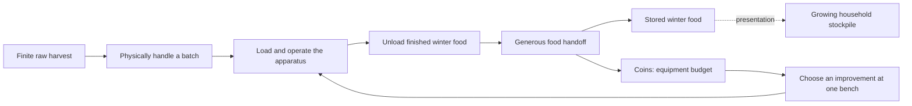

# Core loop and mechanics

[Design index](readme.md) · current processing-and-inventions direction · implementation evidence remains in the queue

**Help Grandpa prepare an unreasonable amount of winter food using increasingly absurd homemade machinery.** Food is the objective, equipment improvements provide progression, and physical handling makes the work enjoyable. Most of the small outdoor yard is walkable from the beginning. Its supplies diminish because the player uses them.

## One complete load

1. Gather a reachable batch from the finite supplies into a freely handled carrier.
2. Pour into a generous feeder, then operate a substantial handle or rack that responds directly to input.
3. Let compressed internal processing finish safely while staging the next batch nearby or playing with loose props.
4. Collect the finished carrier and place it into the broad Finished Food Handoff Rack area. Stored food and Coins increase once for the accepted units.
5. Choose a visible equipment improvement at the nearby bench, attach the assisted-loading kit if chosen, and use the improvement repeatedly on the remaining harvest.

Keep only a few enjoyable whole-batch actions. Roasting judgment, individual peeling, label sorting, and ten-step cooking routines are not required. Today's prototype product is roasted-pepper jars; [additional food activities](scope-and-validation.md#additional-processing-activities) are separate future decisions.

## Pick up, place, and play

The yard is a place to handle things and make room for yourself. Pick up portable objects, choose where to put them, arrange temporary loads, and take useful shortcuts. This applies to the crate, finished-food carrier, and ordinary loose yard props; the wheelbarrow shares the placement freedom with assisted pushing controls.

- **Choose the position.** Place objects within reach on ground, worktops, shelves, or other objects with enough support and clearance. Surface geometry determines whether they fit; named mats, highlighted sockets, or a hidden surface whitelist do not grant permission. Rotate before placing and make stable stacks. An optional alignment assist may help at the chosen position without pulling the object to a compulsory spot.
- **Use physical release as well as careful placement.** Let a released object fall, collide, slide, and settle, including when released above the ground. Small loose props can also be deliberately tossed. Careful placement must be usable without throwing, and holding an object must not drive it through walls or launch the player. A blocked placement preview explains the actual obstruction; it is not a blanket ban on dropping.
- **Make the workspace yours.** Leave a loaded carrier nearby, move a loose basin or stool out of the way, make a temporary stack, or play with a ball while the line works. Use the same grab/place controls for comparable objects. Portable props have no required arrangement, collection counter, reward, or household chore attached. Using supplies makes space and may expose an incidental amusing object; mandatory cleared passages and buried equipment do not drive progression.
- **Let access be physical.** Choose reachable pile faces, staging locations, and routes. Walking around or over a cleared obstacle is a valid shortcut. Most of the yard and all essential work locations are accessible from the start. Equipment improvements are purchased at the nearby bench; reaching or uncovering a prop does not award an upgrade. Yard boundaries and visibly attached fixtures still have ordinary collision. Large installed machinery stays fixed; loose handheld objects should not look grabbable and then arbitrarily refuse interaction.
- **Protect the food, keep the motion.** The model owns carrier contents and exact transfers while physics can own released object motion. Dropping or toppling a loaded carrier preserves its contents as a bulk load; any spill flourish is cosmetic. Neither pepper bodies nor broken glass can scatter required progress into an unrecoverable scavenger hunt. A lost or stuck object recovers with its existing identity and contents, using its last safe pose or a clear fallback location. Authored recovery points are fallbacks, not the only legal places to put things.

Grabbing/place guidance should be contextual and predictable: broad targets, a readable held object, rotation help when useful, and one clear release action. Preserve hold-left-mouse scooping without a mode toggle. Carrier tipping into the station and depositing at the handoff rack remain explicit food transfers, so casually setting something down does not commit food. Tasks must deliver and document the actual Input System bindings and verify overlap priority between grabbing, tipping, and placing.

Careful placement should settle a loaded food carrier predictably at the chosen supported pose, without added launch velocity, random rotation, prolonged bouncing or repeated valid-placement rejection. Deliberate drops and playful props retain appropriate physical motion. Keep the intended reachable target stable and legible when carrier, jars and machine overlap; do not select through an obstruction or let decorative jar meshes steal the carrier's prompt. Reliable deliberate work and optional physical play use the same ownership/recovery rules.

The [purchased attachment's mounting point](#attach-a-purchased-improvement) is a narrow mechanical-fit exception: installing that module uses its known mount. Before installation, the kit can still be freely held, placed or dropped. This does not restrict ordinary carriers or props to sockets or mats.

Use **Pepper pile** or **Peppers left** in player-facing guidance. “Mound” is an authoring description of the heap, not a mechanic or another resource.

This contract revises the fixed-mat crate implementation below. [1_02](development/tasks/1_02_scooping-and-crate-carrying.md#free-placement-feedback-and-revision--september-6-2026) owns its correction; [1_04](development/tasks/1_04_finished-carrier-and-storage-rack.md) adds usable finished output; [1_06](development/tasks/1_06_loose-yard-objects-and-playful-handling.md) extends the shared interaction to a small set of loose props before M2. The [research decision record](design-pivot.md#free-handling-and-research-review--september-6-2026) explains the choices. These are requirements for upcoming work, not features already in the current build.

## Gathering and pouring a batch

Gathering and pouring begin the batch; operating equipment and seeing finished winter food are equally central. Keep broad hold-left-mouse scooping from reachable supplies, release to stop, and local depletion that agrees with what was taken. A diminishing heap is useful feedback, not the campaign's objective. “Pepper pile” is ordinary guidance, not an area-unlock mechanic.

The immediately available crate holds a provisional 12 units. Preserve its satisfying cadence and free handling. Do not deliberately divide a useful crate load into annoying tiny loads to sell a capacity upgrade. Supply can be staged as heaps, sacks or containers using the same finite source rules, with short useful trips around the workstation. Do not add refill chores or haul routes simply to make the yard larger.

Use physics where it improves interaction. Carriers and loose objects may be important physical gameplay objects with reliable contents. Task 1_07 compares a manageable physical pepper batch with grouped representation during pouring/loading: inspect contact, movement, recoverability, readability and cost before choosing. Neither all-individual simulation nor all-cosmetic peppers is predetermined. Sleeping/reuse and a bounded active batch are tools to test, not reasons to prohibit physical play. Mechanisms may use constraints or controlled motion according to their interaction.

Accepted transfers always preserve exact units. An intake with room for 18 accepts 18 from a 48-unit load and retains 30. A rolling pepper or interrupted pour cannot destroy progress or duplicate it. If loose material becomes authoritative, explicitly include its recoverable ownership in the [state contract](development/state-and-saving.md); a transform alone is never an unrecorded second food copy.

### Current crate prototype controls

**Delivered behavior, awaiting the free-placement revision in 1_02.** The current executable still uses the two mats described here; documentation changes do not update that player.

E picks up the crate, tips at the broad intake, or parks beside either marked crate mat. The held crate follows walking, sprinting, and jumping; parking requires the player to stand on the ground beside a clear mat. R recovers player and crate to the gate while preserving the load, cleared regions, and all station food/progress. F8 or **Restart processing test (clears food)** explicitly restores the initial harvest and empties the crate and station.

Hold left mouse to scoop and release to stop further transfers. There is no automatic gathering mode or scoop-mode key. The first valid scoop commits immediately, followed by one unit every 0.5 seconds while a valid region remains under the broad target. Releasing and rapidly clicking cannot bypass the cadence. These are initial feel-test settings, not a timer or acceptance rating. Each accepted unit changes its local region and carried contents; three bounded moving proxies show the transfer. Small leftovers keep a visible pepper clump. Pause/focus loss, recovery, and pickup/parking cancel ongoing input and require release before another action. Full/empty/invalid states retain visible guidance and give one soft cue per meaningful state transition; releasing/repressing alone does not repeat it.

The test mound has nine local depletion regions within one corner, not nine yard pockets. Its three-unit shallow edge lets the player expose ground within one crate load. The complete workflow's gather/travel/service balance must be measured as tipping and output handling arrive; scooping cadence alone does not prove the final ratio.

### Current tipping and processing prototype

Task 1_03 uses one E press at the reachable intake to transfer the accepted amount immediately. The 0.75-second tilt/cascade shows that committed transaction. Looking away, pause/focus loss, or recovery can interrupt the motion; the transferred food stays in the station and any unaccepted food stays in the crate. Holding E does not repeat a dump. After interruption, release before pressing again. Scooping/parking cannot overlap the cascade.

The starting station has a 12-unit input queue, one active batch, and 12-unit accumulating output. Each batch takes four seconds of unpaused gameplay: roasting (1.4), covered rest (0.8), preparation (0.8), then packing/cooling (1.0). These are provisional compressed presentation timings. The line starts automatically, reserving only available output room; queued food beyond that room stays queued. A partly filled output can accept more work, and even a single remaining unit finishes. Three units share a visible jar; its fill shows partial credit exactly.

Full output safely stops new batches while the intake can still buffer one queued load. Full intake keeps the remainder in the crate, with persistent guidance and one soft cue per changed denial state. Waiting never burns or spoils food. Output collection/deposit is task 1_04, so F8 currently starts another test after output and input fill. This temporary prototype boundary does not establish full-cycle balance.

## Operate the machine

**Planned in 1_08; the current 1_03 player starts batches automatically.** The revised modest apparatus has one substantial batch handle or sliding rack. Broad interaction moves the mechanism directly with the player's input, with immediate motion/contact feedback and a forgiving end position. It must do more than acknowledge a click and start a progress bar. Provide an accessible keyboard/mouse operation and no rapid-click requirement, exact listening test, narrow timing window, or penalty for letting go.

Loading places food in the input queue. A completed operation commits the prepared batch into processing once, only with reserved output space. A partially operated mechanism can stop safely; cancel/reset restores a valid mechanical position while keeping committed food. Pause/focus stops its motion and discards stale input. The working batch then completes its compressed internal stages without attendance. Finished food waits indefinitely and can be unloaded as one carrier; add no repeated service lever merely to lengthen the cycle.

Show distinct ready-to-operate, operating, working, finished and output-full states. Partial final batches need the same easy operation and no minimum jar/load rule. A full output blocks starting additional work safely; it never burns, spoils or destroys food. The upgraded apparatus must change useful material movement or operator work, beyond changing this timer or its model.

Automate repetitive confirmations and internal packing: no per-pepper, per-jar or per-substage Start/Confirm/lid/alignment actions. Retain the substantial input-driven batch operation and useful pouring/receiving. Continuous internal work on accepted material is not endless supply or permission to remove the prototype's direct mechanism. A later powered improvement may reduce redundant restarts within its existing scope, but this adds no compulsory continuous-run mode or new upgrade.

## One line with three equipment stages

[Grandpa's equipment](yard-and-progression.md#grandpas-three-equipment-stages) develops at the same outdoor work area: modest apparatus, useful attachments, then an excessive powered assembly. Capacity references 12/48/96 remain provisional test values, not three compulsory sequential purchases. Two independent prototype improvements are visible together: larger coordinated batch/carrier capacity, and an attachment that reduces handling actions or improves whole-batch loading/unloading. Their combinations work in either purchase order.

The capacity option can include a 48-unit wheelbarrow with matching hopper/output support. A wheelbarrow is equipment, not a buried key to the yard; assisted pushing gives easy turning, reversing and free release/regrab where it fits. The handling attachment retains the satisfying operation while reducing redundant transfers or strokes. Do not offer a speed upgrade when processing already keeps up. Do not make baseline controls irritating to create an upgrade benefit.

The later powered machine visibly handles a substantial batch, combines output handling and retains meaningful direct operation. A short feeder extension is an optional useful layout solution, not a mandatory distant-supply reveal or a required route-length reduction. Prove a real improvement in actions per finished batch and the complete job, with repeated work left to enjoy it.

Install whole authored improvements at a safe cycle boundary with existing food preserved. The assisted-loading purchase has the short snap installation below; the capacity package needs no assembly interaction. No parts hunt, factory construction, bolts/wiring puzzles, breakdowns, fuel, jams or repair chores. Purchased improvements remain installed; later changes cannot downgrade prior capabilities. A paid pending installation must neither charge again nor lose its entitlement on recovery/load.

## Make the finished batch worth handling

The transformation to test is **loose harvest → visibly prepared food → orderly jars → a substantial finished carrier → growing winter supply**. Food should be recognizable and desirable to look at and move. Its appeal is abundance and family preparation; success with money in another game does not establish the same feeling for peppers.

The apparatus arranges its finished output automatically. Give receiving a readable tray/carrier movement and a visible jar group, with material/weight/contact cues that agree with the amount. Partial jars and the last small batch remain valid finished work, not a reason to wait for a full carrier. No individual pepper placement, lid tightening, jar alignment or additional packing action. These views use the existing station output and sole carrier, not another inventory or container.

In 1_04, establish this sequence using recognizable simple jar/food shapes and a small progress-derived food group beside the handoff. It grows or fills after each accepted deposit and stays readable from the normal work area. Plain counts support the visible result. M5 supplies [appetizing materials and presentation](look-sound-and-comfort.md#prioritize-the-repeated-actions); production art is not a prototype prerequisite. The [household display contract](household-readiness-and-parcels.md#progress-drives-presentation) keeps local accumulation and the four later household states consistent with one stored total.

## One storage handoff

The **Finished Food Handoff Rack** names one generous winter-food handoff area close to the output. A broad physical placement/deposit target accepts any finished carrier without matching a shelf, label or exact socket. Most of the yard, the supplies, bench, handoff and storage view are accessible from the start. Cellar shelves and family boxes visibly reflect the same stored total; no sorting or recipient inventories are added.

One reusable finished carrier takes available output while preserving active reservations. It can be freely set down, dropped and regrabbed with the same load. Casual placement outside the clearly identified handoff does not deposit. The raw carrier remains at the player's chosen staging point; convenient switching uses nearby clear space without a mat errand. A valid handoff moves its units into stored food once and returns the empty carrier to its output dock, with no empty-container trip or second carrier.

Stored food is permanent accomplishment. Spending never reduces it and the player never withdraws credited jars for another deposit. Loose empty jar props are distinct from the collectable finished carrier and progress-derived food displays. See [household presentation](household-readiness-and-parcels.md).

## Earn and choose equipment

The revised prototype **includes Coins** as an abstract equipment budget. One visible bench/interface beside the apparatus shows both useful improvements from the beginning. Each card shows the actual workflow change, complete price, affordability, available / owned-awaiting-installation / installed status, and installation location or automatic safe-boundary behavior. One price includes the complete attachment/package; no remembered materials list, component shopping or delivery errand. Keep all purchase and installation information at this workstation. No personal/fund wallets, second currency or separate upgrade catalogues; no hidden discovery, yard-access condition, or separate prepared-food threshold followed by payment. Food milestones drive stockpile presentation and Grandpa's reactions only.

Show the changed part the player touches and explain its practical effect: a clean whole-crate pour or fewer finished-carrier trips is clearer than an efficiency percentage alone. A wide hopper or double receiving tray is an example of presenting an existing capacity/handling benefit, not two extra offers. Keep the two approved purchases and one snap installation; each must retain a satisfying physical payoff while removing unnecessary handling or confirmations.

Use a provisional whole-number earn rate of one Coin per accepted pepper-equivalent unit. Credit only the units actually committed by a finished-food handoff. A partial load earns proportionally, and splitting it into several deposits earns the same total. Empty/repeated deposits, collection, tipping, recovery and reload earn nothing extra. Prices are authored test values; tune an early choice after a few ordinary batches, with enough existing supply for repeated use of either choice and eventual access to both.

Purchasing atomically validates affordability and ownership, spends once, and records the improvement or paid pending installation. Reject repeated/unaffordable requests without changing Coins. No purchase order may make the finite harvest impossible or strand an essential improvement; starting equipment can finish all food, with no consumable operating expenses. Use [2_01](development/tasks/2_01_wheelbarrow-discovery-and-loader.md) for implementation and [2_02](development/tasks/2_02_upgrade-throughput-and-handling.md) for comparison/tuning before the 2_03 gate. This is current authorized scope, replacing the pending discovery-versus-Coins experiment.

## Attach a purchased improvement

Task [2_01](development/tasks/2_01_wheelbarrow-discovery-and-loader.md) gives **one of the two prototype purchases, the assisted loading rack**, a short physical installation. Buying it supplies one complete attachment beside the apparatus, with one large readable mounting point. Use the shared grab/place controls, forgiving targeting and alignment, and a clear snap, sound and small mechanism response. The next appropriate batch benefits. The capacity/wheelbarrow package retains installation at a safe boundary without another assembly step or third purchase.

Keep the lifecycle **available → purchased/awaiting installation → installed**. Deduct Coins once and retain ownership immediately. Interrupted placement leaves the paid kit available. Recovery returns the same kit identity beside the machine, invalidating any stray duplicate representation; it never supplies another functional copy or requires another payment. Repeated mounting cannot apply the improvement twice. The [state contract](development/state-and-saving.md#attachment-ownership-and-installation) defines reconstruction and checks.

The existing machine remains usable while the kit is unmounted. Accept a broad placement onto the mount even during work and secure the kit there. Show **Fitted — finish current operation** for an interrupted stroke or **Fitted — installs after current batch** during processing. It remains paid/awaiting installation until the mechanism is safely at rest and no batch is active, before the next operation starts. Let any current stroke and the batch it starts finish normally; the existing safe cancel/reset may also return an uncommitted stroke to rest without changing food. Preserve queued input, reservations and available output; installation does not require emptying the station. At that idle boundary, fitting applies the effect immediately. Once installed, the attachment is part of the fixed machine. No camera takeover, precision rotation, repeated assembly per batch, mandatory tool or long delivery wait/walk.

This is a bounded upgrade payoff, not the primary activity or a crafting framework. A later hero machine may use a few chunky modules only if this interaction proves worthwhile; it is not a new requirement. The [drawing presentation candidate](look-sound-and-comfort.md#optional-later-upgrade-and-lighting-presentation) remains an alternative, never a second mandatory installation ritual.

## Upgrades must improve the whole job

Measure gathering, loaded travel, pouring, direct machine operation, internal wait, output handling, storage and empty return together. Compare the same quantity with the baseline, each first purchase independently, and both combined. Record actions/strokes and transfers per stored batch as well as elapsed time; capacity alone is insufficient. Ask what the player chose, why, and whether they wanted to use the changed apparatus again.

Record one-time purchase/installation effort separately: time finding and understanding the kit/mount, placement attempts and rejections, and any time waiting for the safe boundary. Then measure recurring batch handling/travel before and after, and useful work remaining when purchased. Keep supply, kit, machine and handoff nearby; do not shuttle individual peppers, jars or components across the yard. Never slow enjoyable gathering, add timers or increase mandatory supply to manufacture a better gathering-to-service ratio.

Use 48 units as an initial comparison amount and 96 for the later powered machine when those capacities remain appropriate. Keep supply, start state and nearby work area comparable. If an attachment changes staging/layout, report that effect without manufacturing long baseline walks. Prop play is optional enjoyment and cannot excuse forced waiting. Improve the mechanism or reduce repetitions if the ordinary work is dull; more supply, jokes and additional recipes cannot establish that it works.

## Minimal progress and recovery

Keep the finite harvest accounted for across raw sources, carriers, any explicitly registered loose material, queued/active work, finished output and stored food. Three pepper units per visible jar is a provisional visual abstraction; exact partial units still count. Physical representation and food ownership must agree without requiring a scavenger hunt for lost bodies.

Recovery preserves contents, Coins, purchases, machine state and valid player arrangements. A prototype restart is explicitly destructive and restores authored food, equipment, budget and poses together. Pause/focus freezes gameplay and physics. M3 adds coherent saves of food, mechanism state, poses, Coins and paid/installed upgrades; loading cannot replay earnings or spend twice.

The final valid handoff completes winter preparation when every initial unit is stored and no food remains in transit or processing. Keep normal movement/camera/menu control with the finished stockpile visible. Yard neatness, prop arrangements, purchased equipment, cellar sorting and an extra finish button add no requirements. [Finish conditions](household-readiness-and-parcels.md#finish-conditions) retain the exact completion contract.
