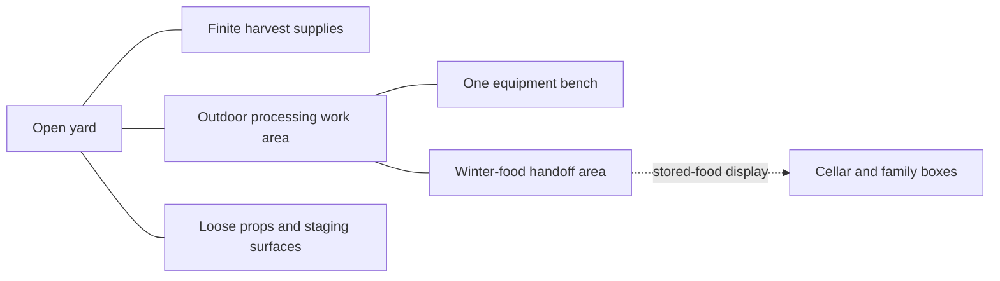

# Yard and progression

[Design index](readme.md) · current processing-and-inventions direction

One compact outdoor Bulgarian yard is the setting for preparing winter food. Most of it is walkable from the start: harvest supplies, Grandpa's work area, equipment bench, generous handoff area, shed/cellar views and vine table are visible or readily reachable. Equipment choices make the player more capable. Using finite supplies makes room as a consequence.

## One property, several useful approaches

Keep the source/apparatus/handoff triangle short. Let the player choose staging positions and rearrange portable clutter under the [handling contract](core-loop-and-mechanics.md#pick-up-place-and-play). Occasional movable obstructions are believable; mandatory blocked passages and buried tool access no longer drive progression.

The former A–E map, five-pocket structure and 732-unit allocation are historical sketches. Choose the smallest layout that supports comfortable work and readable equipment. Supply groups may retain local-depletion IDs without becoming locked areas. All initial supply is accounted for and usable with baseline equipment; taking a different route cannot lock progress or reveal a surprise mandatory refill.

Cooking stays outside on the terrace. The shed and cellar remain compact views, with no cooking level or cellar gate to clear. The handoff and storage view are available from the start; the street stays a backdrop.

## Choose equipment at the workbench

**Purchased equipment improvements change the next batch.** Seeing an amusing object or lifting a tarp can add personality, but uncovering a wheel, clearing a passage or collecting components does not award equipment. Installation presentation follows the purchase at the existing workstation.

Food handoffs award Coins separately from cumulative stored food. One bench shows both prototype choices, prices and effects from the beginning. No automatic food milestone followed by a second payment. Food milestones and Grandpa's reactions are presentation. See [earning and purchases](core-loop-and-mechanics.md#earn-and-choose-equipment).

Each card includes the whole price, workflow benefit, availability/owned-awaiting-installation/installed state and installation location. Buy a complete improvement at this one workstation, with no second wallet, materials list or shop to remember. The assisted-loading kit appears beside its large machine mount for the [one prototype snap installation](core-loop-and-mechanics.md#attach-a-purchased-improvement); the capacity package adds no assembly step. Keep supply, kit and handoff close enough for useful batch handling, without individual-item hauling.

## Grandpa's three equipment stages

These describe visual/capability stages, not a mandatory three-node purchase chain. The prototype tests two useful improvements in either order.

| Apparatus | Player experience | Reference capability |
| --- | --- | --- |
| Modest setup | Load a useful batch, directly move a substantial handle/rack, collect food that waits safely. | Crate and input/output around 12 units; retain a pleasant baseline. |
| Useful conversions | Choose coordinated larger batches or an attachment that reduces loading/receiving actions. The next batch moves differently. | Capacity can include a 48-unit wheelbarrow and matching station/output support; handling remains useful at either capacity. |
| Excessive assembly | An enclosed, rattling powered conversion moves a substantial batch and combines output handling. Grandpa treats it as ordinary equipment. | A later 96-unit input/output target can combine two wheelbarrow loads while retaining meaningful direct operation. |

2_01 defines and implements the two offers with exact effects and costs. 2_02 proves that each first purchase improves actual work and their combination preserves both benefits. Do not sell faster processing when it already keeps up, or deliberately awkward controls/tiny split loads to make an attachment desirable.

4_02 extends the same bench/apparatus with the powered conversion after the core gate, while repeated useful work remains. Clearly displayed equipment prerequisites are allowed where technically necessary, but no hidden yard access, parts hunt or prepared-food threshold. Both earlier purchase orders remain valid. Treat 12/48/96 as provisional references; an improvement must do more than increase a number.

Install whole authored attachments at safe cycle boundaries, preserving loads, paid entitlement, queued work, output and earlier capabilities. A local feeder extension may help, but the mandatory distant final-supply chute and substantial haul-reduction requirement are retired. Prove distinct physical operation/material movement and a better complete food job. No breakdowns, fuel, jams, repair chores, component hunts or factory construction.

## Finite supply and pacing

Author the total before play. The existing 107-unit pile can be reused for early tests; it is not a required prototype quantity or a mandate to focus on clearing a mound. Stage useful supplies near the apparatus, retain optional broad scooping and test physical batches before expanding content.

Tune initial prices so either visible improvement is affordable after a few ordinary finished batches. Record earn rate, prices, finite total and remaining work when each can be bought. Partial batches earn proportionally; splitting loads earns no bonus. Starting equipment must finish the harvest, either purchase order must remain viable, and the finite budget must support intended later equipment with enough work to enjoy it. Never add mandatory supply to rescue a bad purchase order or cancel an upgrade's benefit.

**Opening:** handle one batch, operate the apparatus, see winter food and earn Coins.

**Middle:** choose an improvement, snap on the loading attachment if chosen, repeatedly use its changed mechanism/capacity, compare another purchase order and watch the stockpile grow.

**Finale:** install and enjoy Grandpa's excessive conversion, finish the last partial batch and hand it off. The accomplishment is winter food; control remains available afterward.

Measure enjoyable repetition before choosing supply and duration. Reduce needless travel, operations or quantity when the loop drags. Prop play, jokes and future foods do not excuse forced waiting or weak machinery.

Measure the one-time installation's clarity/time and placement attempts separately from recurring batch work. Prices and finite supply must leave repeated useful work after either first purchase. The harvest remains self-paced: no stress, compulsory rest, bedtime, daily reset or night-only production. Any later lighting change is atmosphere only; completion still leaves access to the finished yard.
