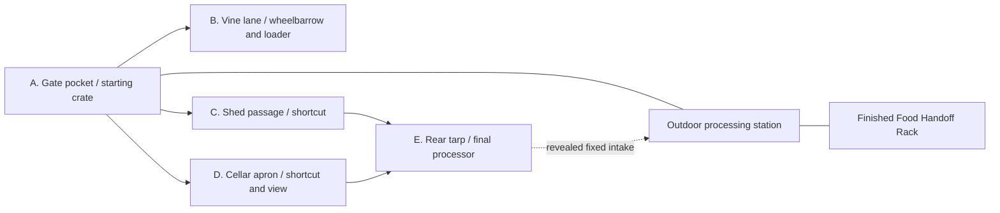

# Yard and progression

[Design index](readme.md) · Just a few peppers · v4 focused first-game scope

One compact outdoor property holds the entire project: pepper piles, the processing terrace, a small shed view, a cellar view, and the vine table. Grandpa's tiny appliance sits beside an unreasonable supply. The story is family winter preparation; the player's job is the finite pepper harvest.

## One property, several useful approaches

This is an illustrative five-pocket sketch, not a required map. **Up to five is a maximum, not a target.** Choose the final count after measuring the core prototype. If three or four areas deliver the whole arc, merge approaches and their scenery instead of adding a fifth. The A–E labels below are sketch references, not required content IDs or a fixed task order. After the short opening, the player chooses a visible tool or useful approach; in this sketch either C or D reaches the tarp. There is no grinder discovery or recipe unlock requirement.

The station and **Finished Food Handoff Rack** are reachable from the start. The cellar is a compact view of stored progress, even before its approach opens. Clearing the apron creates a shorter path back to the same handoff rack. The player never moves food from that rack to the cellar or family boxes; automatic household presentation represents its distribution.

All roasting and preparation stay outside on an open-sided terrace. The shed contains scenery and tools; the street stays a backdrop. A reachable, already-open old refrigerator serves as a tool cupboard with a decorative grinder. Its reveal adds a memorable view along a useful shortcut.

## Discoveries change the next load

| Pocket | What is visible early | Reward | Placement rule |
| --- | --- | --- | --- |
| A. Gate | An available crate and the operating station. | Immediate 12-unit bulk handling and a view into other approaches. | No hand-picking or cooking tutorial before the first useful load. |
| B. Vine lane | A wheel and handle in a shallow part of the pile. | Wheelbarrow plus the folded loading modification. | Expose them after a small reachable pocket, while substantial work remains. |
| C. Shed passage | A route between the shed and terrace; the reused cupboard beyond. | Shorter hauling and one approach to the rear tarp. | Its practical reward is access, not a replacement grinder quest. |
| D. Cellar apron | A glimpse of older pantry food and the route back to the rack. | A better food display view, shorter return route, and another approach to the tarp. | Rack deposits work before this path opens. |
| E. Rear tarp | A suspiciously large covered silhouette and an intake facing the remaining supply. | Grandpa's final processor, fewer output trips, and a substantially shorter loaded route to its fixed intake. | Reveal it with enough untouched supply for repeated complete scoop-to-deposit cycles, not just one demonstration dump. |

Paths and reveals follow cleared local pockets. Removing the last visual decoration or acquiring a collectible cannot gate access. All stock is accepted by the starting station, so equipment can always be reached with existing tools.

Every retained area should support **see useful thing → clear toward it → gain useful capability or route → immediately use it on remaining work**. Reuse or merge cultural prop arrangements when reducing the pocket count; their presence does not justify another clearing area.

## Grandpa's three equipment stages

| Stage | Presentation | Intake / output capacity | Practical improvement |
| --- | --- | --- | --- |
| Familiar appliance | Recognizable chushkopek with a modest fictional automatic feeder and finishing setup. | 12 / 12 units. | Dump one crate and collect one finished load. |
| Grandpa's modification | The wheelbarrow's discovery also supplies an oversized feed rack, tipping guide, and larger output support. | 48 / 48 units. | Dump one wheelbarrow in one broad action; processing and output keep up with the larger load. |
| The tarp reveal | A comically substantial homemade processor replaces the station front end; its fixed loading chute reaches the final supply through the revealed layout. | 96 / 96 units. | Substantially shorten loaded hauling, feed two wheelbarrow loads, and collect their combined output in one trip. |

The raw carrier progression is crate 12 → wheelbarrow 48. The final station's 96-unit capacity is not a further raw carrier upgrade.

All stages use one logical input, one product, one output interaction, and the same handoff rack. The final reveal exposes/extends a fixed loading chute near the last supply; its intake becomes the one active broad dump target feeding the existing station buffer. The output dock and nearby handoff rack stay fixed. No second machine queue, extra destination, conveyor layout, construction, repair, resource, UI subsystem, or control is needed.

Installation preserves contents and takes effect at a safe cycle boundary. Restore the active intake position from installed tier; it has no separate inventory or unlock task. The final machine can be reached before the wheelbarrow and then accepts the current crate. Later discoveries never downgrade equipment or remove the shorter route. There is one active line.

Its hopper, worn handle, patched-looking brackets, and visible feed motion give Grandpa's invention character. These are authored models/animations, not component assembly or a factory layout. The specific household design is fictional, with [real industrial equipment as inspiration](research-and-authenticity.md#mechanical-inspiration-for-grandpas-invention).

## Finite supply and pacing

Keep the existing illustrative supply only as a starting balance example:

| Pocket | Pepper-equivalent units |
| --- | ---: |
| A | 12 |
| B | 96 |
| C | 144 |
| D | 192 |
| E | 288 |
| Total | 732 |

All 732 units end in the single stored-food total. There are no parcel deductions, extra recipient quotas, or recipe ratios. At the provisional three-units-per-visible-jar scale, 244 jar equivalents describe the combined display rather than 244 individually handled objects.

The total is authored from the start. Show unexplored pockets on a rough yard sketch if an overall progress measure is used; hidden supply must not enlarge a previously advertised total. Clearing opens views of existing piles and never respawns peppers in cleared space.

Tune quantities after measuring an enjoyable section. The table is not a promised campaign duration, a required production budget, or a reason to keep five pockets if fewer produce a better arc. Improvements must save effort; avoid exactly cancelling every capacity upgrade with more mandatory supply.

For the final reveal, record the remaining accessible supply and how many complete final-tier cycles it supports. Position the reveal pocket so ordinary clearing exposes the machine before exhausting that supply. Adjust the approach or reduce earlier work if necessary; do not spawn more peppers or add another pocket to rescue a late reveal. Verify the combined layout/capacity benefit using the [whole-workflow comparison](scope-and-validation.md#later-checks-for-the-complete-game).

**Opening:** collect a substantial crate load immediately and see what comes out.

**Middle:** choose a visible tool or shortcut, feel a larger scoop and dump, and see stored food accumulate.

**Finale:** uncover Grandpa's excessive solution while meaningful supply remains, repeatedly enjoy the shorter haul and larger output collection, and use the last deposit to complete the winter-food display. Completion automatically starts the family-meal ending.

No fixed clearing intervals, forced waits, household checklist, or post-game favors extend this arc.
